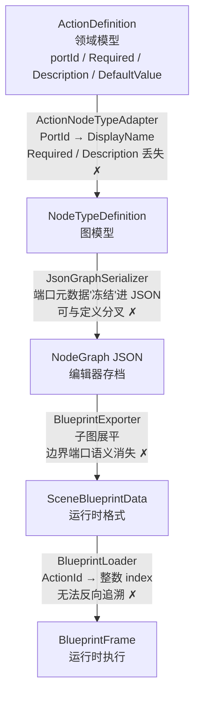
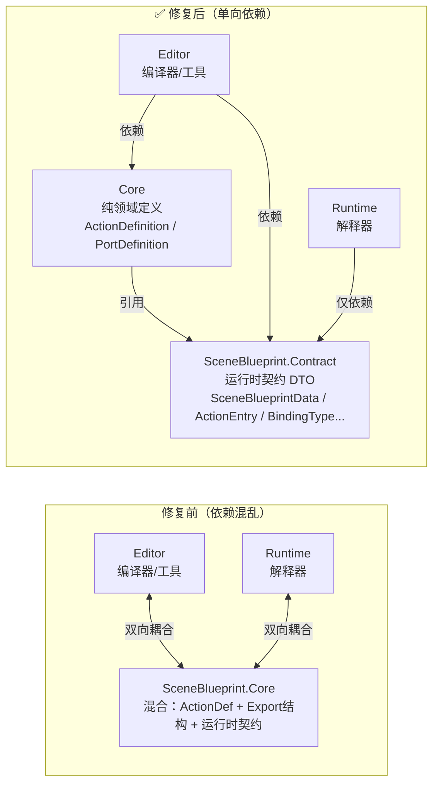
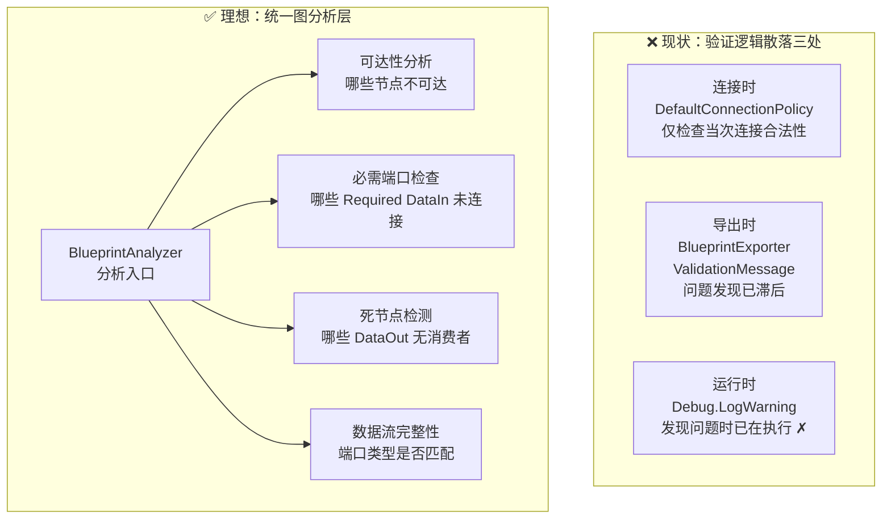
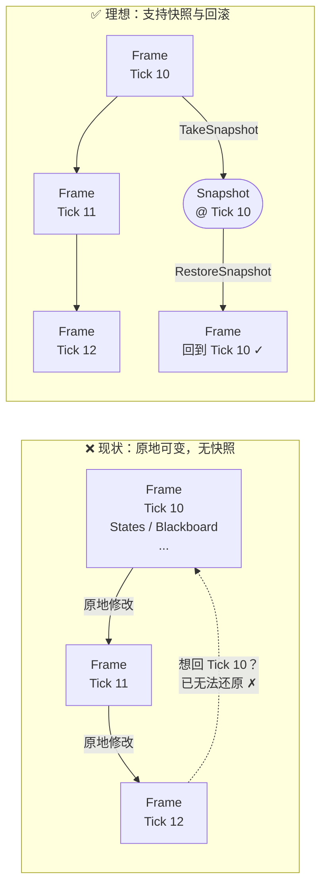
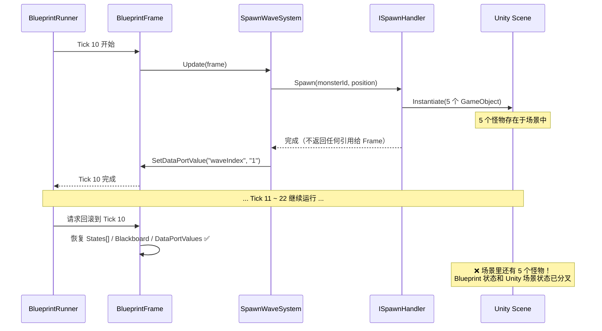

# SceneBlueprint 框架优化分析与改进路线

> doc_status: active  
> last_reviewed: 2026-02-22  
> 本文档整合了 2026-02-20 针对 NodeGraph + SceneBlueprint 框架的系统性分析讨论，  
> 涵盖"近期打补丁修复的根因"、"顶层架构缺陷"、"中层模块设计问题"和"改进优先级路线"。  
> 各阶段实施结果详见第八章（T1）、第九章（T2）、第十章（本轮运行时优化批次）。

---

## 零、整体优化进度总览

> 快速索引：所有已完成 / 进行中 / 推迟项汇总，详细实施记录见各章节。

### 顶层架构专项（T 系列）

| 专项 | 状态 | 完成日期 | 详见 |
|------|------|----------|------|
| **T1** 序列化层重构（JSON 只存骨架，端口从 TypeDefinition 重建） | ✅ 已完成 | 2026-02-21 | 第八章 |
| **T2** Editor / Runtime 边界隔离（Contract 程序集，Runtime 不依赖 Core） | ✅ 已完成 | 2026-02-21 | 第九章 |
| **T3** NodeGraph 核心稳定化（EdgeData 删除、SemanticId 分离） | ✅ 已完成 | 2026-02-21 | 第六章 P1 |
| **T4** 图分析层（BlueprintAnalyzer + 5 条规则 + 节点高亮 + 导出门控） | ✅ 已完成 | 2026-02-21 | 第六章 P3 |
| **T5** SceneBlueprintData 版本化 | ⏸ 推迟 | — | — |

---

### 改进优先级路线（P 系列）

| 编号 | 项目 | 状态 | 完成日期 | 方案选择 |
|------|------|------|----------|----------|
| P1-1 | SemanticId 从 PortDefinition 分离 | ✅ 已完成 | 2026-02-21 | — |
| P1-2 | EdgeData 删除，边类型从源端口 Kind 推断 | ✅ 已完成 | 2026-02-21 | — |
| P1-3 | DataIn 端口 DefaultValue 支持 | ✅ 已完成 | 2026-02-21 | — |
| P1-4 | Any 类型表示统一（`"any"` 为唯一通配符） | ✅ 已完成 | 2026-02-22 | `DataTypes.Any = "any"` |
| P1-5 | BlueprintRunner 暂停 API + 场景侧完整覆盖 | ✅ 已完成 | 2026-02-21/22 | 静态标志（MonsterBehavior）|
| P2-1 | ConnectionPolicy 改为责任链 | ✅ 已完成 | 2026-02-22 | 方案 B（IConnectionValidator 链）|
| P2-2 | TypeAdapter SemanticId 对齐 | ✅ 已完成 | 2026-02-21 | — |
| P2-3 | 端口 Required 导出时强制检查 | ✅ 已完成 | 2026-02-21 | T4 SB002 规则 |
| P2-4 | Schema 版本字段 | ⏸ 推迟 | — | — |
| P2-5 | BlueprintFrame 快照 API（只读检视）| ✅ 已完成 | 2026-02-21 | 环形缓冲 + 值快照 |
| P2-6 | Blackboard 存储层类型安全 | ✅ 已完成 | 2026-02-22 | 方案 B（IBlackboardEntry 接口）|
| P3-1 | 端口 Id 编译时绑定（魔法字符串消除）| ✅ 已完成 | 2026-02-22 | 方案 A（ActionPortIds 替换全层）|
| P3-2 | 显式 Compile 步骤（Export 内含编译验证）| ✅ 已完成 | 2026-02-22 | 方案 B（Export 内含 Compile）|
| P3-3 | 图分析层（T4）| ✅ 已完成 | 2026-02-21 | — |
| P3-4 | 轻量级检查点回滚（方向 A）| ⏸ 推迟 | — | 推迟至有明确产品需求 |
| P3-5 | 完整 EffectCommand Buffer（方向 B）| ❌ 不实施 | — | 成本过高，不在近期路线 |

---

### 调试与测试工具增强

| 项目 | 状态 | 完成日期 |
|------|------|----------|
| BlueprintTestWindow Blackboard 历史展示 | ✅ 已完成 | 2026-02-21 |
| BlueprintTestWindow 实时 Blackboard 变量面板 | ✅ 已完成 | 2026-02-21 |
| BlueprintFrameSnapshot + BlueprintFrameHistory（只读时间轴）| ✅ 已完成 | 2026-02-21 |

---

### 当前遗留项 / 下一步

| 项目 | 优先级 | 备注 |
|------|--------|------|
| ⏸ Schema 版本字段（SceneBlueprintData T5）| 低 | 等待明确的 JSON 版本升级需求 |
| ⏸ 轻量级检查点回滚 | 低 | 需 SpawnSystem 记录 Tick→GameObject 映射 |
| TypeAdapter SemanticId 缓存优化 | 低 | 当前无性能问题，按需启动 |

---

## 一、近期补丁修复汇总（根因回溯）

以下修复均在 2026-02-20 落地，但它们本质上都是对更深层设计问题的"临时补丁"。

| 编号 | 修复文件 | 修复内容 | 根本原因 |
|------|----------|----------|----------|
| DI-3 | `DataTypeRegistry.IsCompatible` | 空串=Any 修复 | Any 类型在两层有不同表示（`""`vs`"any"`） |
| DI-4 | `TypeCompatibilityRegistry.IsCompatible` | 空串=Any 修复 | 同上 |
| DI-5 | `ActionNodeTypeAdapter.ConvertPort` | Data 端口空 DataType 不再覆盖为 `exec` | Adapter 层混淆了"无类型(Any)"和"控制流(exec)" |
| DI-6 | `DefaultConnectionPolicy` | Data 端口 `exec` DataType 视为 Any | 旧 JSON 里存了错误的端口 DataType |
| DI-7 | `SceneBlueprintConnectionPolicy` | 同上 | 同上 |
| DI-8 | `BlueprintExporter.IsDataEdge` | 改用源端口 Kind 判断，不依赖 EdgeData | EdgeData 从未被序列化/反序列化，永远为 null |
| DI-9 | `预设怪物测试蓝图.json` | waveIndex→compareValue 从 Transitions 移到 DataConnections | IsDataEdge bug 导致所有边都落入 Transitions |

**共性根因**：端口元数据存在 JSON 里但可能过期（DI-6/7/8/9）+ 两套类型系统未统一（DI-3/4/5）。

---

## 二、顶层架构缺陷（T 系列）

### T1：三层语义翻译链，信息逐层丢失 ✅ 已完成（2026-02-21）

```
ActionDefinition（领域模型）
  ↓ ActionNodeTypeAdapter  ← PortId → DisplayName，Required/Description 丢失
NodeTypeDefinition（图模型）
  ↓ JsonGraphSerializer    ← 端口元数据"冻结"进 JSON，可与定义分叉
NodeGraph JSON（编辑器存档）
  ↓ BlueprintExporter      ← 子图展平，边界端口语义消失
SceneBlueprintData（运行时格式）
  ↓ BlueprintLoader        ← ActionId → 整数 index
BlueprintFrame（运行时执行）
```



- 每层翻译都是单向、有损的
- 从运行时帧**无法反向追溯**到原始 ActionDefinition
- 某层出错，后续层只能打补丁

**业界参考**：Unreal Blueprint 只有两层——源数据（`.uasset`）和字节码（编译产物）。编译是**显式触发**的步骤，编译结果不混入源文件。

---

### T2：Editor / Runtime 边界没有物理隔离 ✅ 已完成（2026-02-21）

**修复前**：`SceneBlueprint.Core` 同时服务于两端——
- 编辑器使用 `ActionDefinition`、`PortDefinition` 构建图
- 运行时 System 使用 `Core.Export`（`ActionEntry`、`TransitionEntry`、`DataConnectionEntry`）

`SceneBlueprintData` 这个"编译产物"原本放在 `Core.Export` 命名空间里，实际上是运行时专属结构，不是领域核心。



---

### T3：没有稳定的语义身份标识（Stable Semantic Identity）✅ 已完成（2026-02-21）

NodeGraph 层用 GUID 标识一切，唯一性好，但**不稳定**：
- `waveIndex` 是 `SpawnWaveDef` 里定义的语义 ID，在 NodeGraph 层只是 `Port.Name` 的一个字符串
- `ResolvePortSemanticId` 靠 DisplayName 反查语义 ID，依赖"DisplayName 唯一"这个隐式约定
- 一旦两个端口同向同名，或者 DisplayName 被修改，匹配会静默出错

```mermaid
flowchart TD
    subgraph current["❌ 现状：DisplayName 反查（脆弱）"]
        A1["SpawnWaveDef<br/>portId = 'waveIndex'"]
        B1["NodeTypeDefinition<br/>port.Name = '波次索引'<br/>DisplayName（已丢失原始 ID）"]
        C1["NodeGraph JSON<br/>存的是 DisplayName"]
        D1["ResolvePortSemanticId<br/>遍历端口，匹配 DisplayName == port.Name"]
        E1["SceneBlueprintData<br/>fromPortId = ???"]

        A1 -->|"Adapter 翻译<br/>portId 丢失 ✗"| B1
        B1 -->|"序列化"| C1
        C1 -->|"DisplayName 改名 或 同向同名<br/>→ 静默匹配错误 ✗"| D1
        D1 --> E1
    end

    subgraph ideal["✅ 理想：双 ID 方案（稳定）"]
        A2["SpawnWaveDef<br/>semanticId = 'waveIndex'"]
        B2["Port<br/>semanticId = 'waveIndex'（稳定）<br/>guid = 'abc123'（实例唯一）"]
        C2["NodeGraph JSON<br/>存 semanticId"]
        D2["SceneBlueprintData<br/>fromPortId = 'waveIndex' ✓"]

        A2 -->|"直接传递 semanticId"| B2
        B2 -->|"序列化 semanticId"| C2
        C2 -->|"直接使用，无反查"| D2
    end
```



**业界参考**：Unreal `FEdGraphPin` 同时有 `PinName`（语义，稳定）和 `PinId`（GUID，实例唯一）。序列化时连线用语义 ID 存储，运行时用实例 ID 查找。

---

### T4：缺少统一的图分析层 ✅ 已完成（2026-02-21，详见第十章）

当前"验证"散落在三处：
- 连接时（`DefaultConnectionPolicy`）
- 导出时（`BlueprintExporter` 里的 `ValidationMessage`）
- 运行时（System 里的 `Debug.LogWarning`）

没有统一的图分析层能回答：
- 哪些节点不可达？
- 哪些必需 DataIn 端口未连接？
- 哪些 DataOut 端口的值从未被消费？



**业界参考**：Unreal `KismetCompiler` 的 Pre-compile 阶段 / Unity Visual Scripting 的 `Analysis` 系统。

---

### T5：没有 Schema 版本管理 ⏸ 暂不实施（用户决策：版本管理问题暂时搁置）

两个 JSON 格式（NodeGraph JSON + SceneBlueprintData JSON）都没有 `"version"` 字段：
- 旧文件静默加载，产生错误数据（本次 DI-6/7 补丁的来源之一）
- 无法检测文件是否需要迁移
- 无法在加载时给出有意义的错误提示

---

## 三、中层模块设计问题（M 系列）

### M1：`NodeGraph.Core.Graph` — 职责过重 ✅ 已完成（2026-02-21）

**修复前**的问题：`Graph.Connect()` 在 Single 端口容量超出时会**静默断开旧边**，但不向调用方声明这一副作用。`ConnectCommand` 不得不在调用前预检并手动保存旧边——责任反向外泄给调用方。

**修复方案**：新增 `ConnectResult` 结构体，`Graph.Connect()` 返回类型从 `Edge?` 改为 `ConnectResult`，显式声明所有副作用。

```csharp
// ConnectResult.cs（新建）
public readonly struct ConnectResult
{
    public Edge? CreatedEdge  { get; }  // 新建的连线
    public Edge? DisplacedEdge { get; } // 被顶替的旧边（Single 端口替换时非 null）
    public bool  Success       => CreatedEdge != null;
    public static ConnectResult Rejected => new ConnectResult(null, null);
}
```

**ConnectCommand 精简前后对比**：

| | 修复前 | 修复后 |
|--|--------|--------|
| Execute | 14 行预检 + 4 个字段保存旧边 + 调用 Connect | 3 行：调用 Connect，读 result |
| Undo | 单独还原 3 个字段组装旧 Edge | 直接 AddEdgeDirect(_displacedEdge) |

**附带清理**：`AssemblyInfo.cs` 删除了无实际使用的 `InternalsVisibleTo("NodeGraph.View")`（经全库搜索，View 层不调用任何 Core internal 成员）。

`GraphSettings` 目前仅 4 个属性（Topology / ConnectionPolicy / TypeCompatibility / NodeTypes），不存在实质膨胀，暂不处理。

---

### M2：`NodeGraph.Serialization` — 零版本化 + 端口过度序列化 ✅ 已完成（2026-02-21）

**三个子问题全部处理完毕：**

| 子问题 | 处理方式 | 时间 |
|--------|---------|------|
| 端口元数据过度序列化（kind/dataType/capacity 存 JSON 副本） | S4：`_typeProvider` 可用时 `skipPorts=true`，普通节点端口不写 JSON | 早期 |
| `schemaVersion` 只写不读，v1 文件加载时静默丢边 | A2：`ModelToGraph()` 头部加版本检查，`schemaVersion < 2` 时抛出含版本号和迁移提示的明确错误 | 2026-02-21 |
| `IUserDataSerializer` 中 `SerializeEdgeData` / `DeserializeEdgeData` 是死代码 | B1：从接口删除两个方法；`ActionNodeDataSerializer` 删除实现；`JsonEdgeModel` 删除 `userData` 字段；`JsonGraphSerializer` 删除边 UserData 读写代码 | 2026-02-21 |

**`IUserDataSerializer` 修复前后对比：**

```csharp
// 修复前：4 个方法，2 个是死代码
public interface IUserDataSerializer {
    string SerializeNodeData(INodeData data);
    INodeData? DeserializeNodeData(string typeId, string json);
    string SerializeEdgeData(IEdgeData data);    // ❌ 永远不被调用
    IEdgeData? DeserializeEdgeData(string json); // ❌ 永远不被调用
}

// 修复后：只保留有意义的节点序列化
public interface IUserDataSerializer {
    string SerializeNodeData(INodeData data);
    INodeData? DeserializeNodeData(string typeId, string json);
}
```

---

### M3：`SceneBlueprint.Core.ActionDefinition` — 约束表达能力不足 ✅ 已完成（2026-02-21）

**三个子问题全部处理完毕：**

| 子问题 | 处理方式 |
|--------|---------|
| `PortDefinition.Required` + 分析层检查 | 早期已有；SB002（RequiredPortRule）负责检查 |
| `ActionDefinition` 没有 Validate 钩子 | 新增 `IActionValidator` 接口（Core 层）、`NodeValidationContext`、`ValidationIssue`；`ActionDefinition.Validator` 字段；SB006（`TypeValidationRule`）调用 |
| `PortDefinition` 没有 `DefaultValue` | `PortDefinition.DefaultValue` 字段新增；`Port.DataIn()` 工厂方法支持 `defaultValue` 参数 |

**新增文件（Core 层，无 Editor 依赖）：**
- `Core/IActionValidator.cs` — 类型级验证器接口
- `Core/NodeValidationContext.cs` — 传给 Validator 的轻量上下文（NodeId / Definition / ConnectedPortSemanticIds / Properties）
- `Core/ValidationIssue.cs` — Validator 返回的结果类型（Message / IsError / PortId）

**分析规则扩展：**
- `Editor/Analysis/Rules/TypeValidationRule.cs`（SB006）：对每个可达业务节点，若 `actionDef.Validator != null`，组装 `NodeValidationContext` 并调用，结果转为 `Diagnostic`
- `SceneBlueprintProfile.CreateAnalyzer()` 注册顺序：`SB003 → SB001 → SB002 → SB006 → SB004 → SB005`

**使用方式（将来扩展时）：**
```csharp
new ActionDefinition
{
    TypeId = "Flow.Branch",
    Validator = new BranchValidator(),  // 实现 IActionValidator
    Ports = new[] { ... }
}
```

---

### M4：`SceneBlueprint.Editor.ActionNodeTypeAdapter` — 无缓存 + 脆弱反查 ✅ 已完成（2026-02-21）

**两个子问题全部处理完毕：**

| 子问题 | 处理方式 |
|--------|---------|
| `ResolvePortSemanticId` 脆弱反查 | 早期已删，SemanticId 直接透传（`sbPort.Id` → `semanticId`） |
| `ActionRegistry` 被多次构造，`AutoDiscover()` 重复执行 | 方案 C：`Create()` 返回 `(BlueprintProfile, ActionRegistry)` 元组；`CreateTypeProvider()` 改为实例方法，`_profile` 已存在时直接复用 `_profile.NodeTypes` |

**修复前的冗余调用链（打开一个蓝图文件）：**
```
AutoDiscover[1]  SceneBlueprintProfile.Create() 内部
AutoDiscover[2]  InitializeForAsset() → CreateActionRegistry()（用于 Inspector）
AutoDiscover[3]  LoadAsset() → CreateTypeProvider() → CreateActionRegistry()（用于序列化器）
RegisterAll[2]   同上
```

**修复后：**
```
AutoDiscover[1]  SceneBlueprintProfile.Create()，返回 ActionRegistry
  └─ InitializeForAsset() 保存到 _actionRegistryCache，直接传给 Inspector   ← 消除 AutoDiscover[2]
  └─ LoadAsset() → CreateTypeProvider() → 复用 _profile.NodeTypes            ← 消除 AutoDiscover[3] + RegisterAll[2]
DomainReload 路径（_profile 为 null）仍走完整构建，可接受
```

---

### ✅ M5：`SceneBlueprint.Runtime.Systems` — 魔法字符串 + 魔法数字（已完成）

**实施总结（P1 + P2 + P3 全部落地）：**

**P1a：执行顺序声明式化（仿 DOTS [UpdateAfter]）**
- 新增 `Runtime/Interpreter/SystemGroupAttribute.cs`：`SystemGroup` 枚举（Framework=0 / Business=100 / PostProcess=900）、`[UpdateInGroupAttribute]`、`[UpdateAfterAttribute]`
- `BlueprintRunner.EnsureSystemsSorted()` 改为分组 + Kahn 拓扑排序，支持 `[UpdateAfter]` 依赖声明
- `BlueprintSystemBase.Order` 标记 `[Obsolete]`，保留向后兼容
- 所有 10 个 System 文件移除 `Order` 魔法数字，改为声明式属性（如 `[UpdateInGroup(SystemGroup.Business)]` `[UpdateAfter(typeof(SpawnPresetSystem))]`）

**P1b：TypeId 常量化**
- 新增 `Core/ActionTypeIds.cs`（`AT` 静态常量类）：所有内置 TypeId 常量按分类嵌套（`AT.Flow.Start`、`AT.Spawn.Wave` 等）
- 所有 System 文件和 Def 文件中的 `"Flow.Filter"`、`"Spawn.Wave"` 等 TypeId 字符串替换为 `AT.xxx` 常量

**P2：端口/属性 Key 常量化（Def 内嵌 + Runtime 引用 Actions）**
- 9 个 Def 文件内嵌 `public static class Ports` / `public static class Props` 常量（FlowFilterDef、SpawnWaveDef、BlackboardGetDef、BlackboardSetDef、TriggerEnterAreaDef、FlowJoinDef、FlowDelayDef、CameraShakeDef、ShowWarningDef）
- `SceneBlueprint.Runtime.asmdef` 新增对 `SceneBlueprint.Core` 和 `SceneBlueprint.Actions` 的引用
- 所有端口/属性字符串（`"compareValue"`、`"onWaveStart"`、`"waves"` 等）替换为 `FlowFilterDef.Ports.CompareValue`、`SpawnWaveActionDef.Ports.OnWaveStart` 等编译时常量

**P3：代码生成器**
- 新增 `Editor/ActionPortIdsGenerator.cs`：菜单 `SceneBlueprint → 生成 ActionPortIds.cs (P3)` 扫描所有 `IActionDefinitionProvider`，自动生成 `Core/Generated/ActionPortIds.cs`，供不依赖 Actions 程序集的代码使用

---

### M6：`BlueprintFrame` — 纯可变状态，无快照能力 ✅ 调试检视已完成（2026-02-22）

- 无法在两个 Tick 之间 diff 出"哪个节点状态变了"
- 无法"回退"到上一个 Tick 的状态（调试/重放困难）
- 单元测试一个 System 需要构造完整的 Frame，测试代价高
- `DataPortValues` 是"推（Push）"模型，生产者必须在触发事件前写值——这是隐式时序契约，顺序写反不会有任何编译/运行时错误



**业界参考**：Unreal Blueprint VM 维护栈帧快照；ECS（DOTS）通过双缓冲区支持前后帧对比。

**已实现（方案 II：Pause & Step 只读历史检视）：**

| 新增类 | 位置 | 说明 |
|--------|------|------|
| `StateDiff` | Runtime.Interpreter.Diagnostics | 相邻帧 Phase 变化记录（readonly struct，零GC） |
| `BlueprintFrameSnapshot` | Runtime.Interpreter.Diagnostics | 单帧状态快照：`States[]` 值拷贝 + `PendingEvents[]` + `Diffs[]`，对象池复用 |
| `BlueprintFrameHistory` | Runtime.Interpreter.Diagnostics | 环形缓冲区（预分配 N 个快照槽），`Record()` / `GetByIndex()` / `GetByTick()` |
| `BlueprintDebugController` | Runtime.Interpreter.Diagnostics | 暂停/步进/时间轴跳转；`IsPaused` / `StepBack()` / `StepForward()` / `SeekToTick()` |
| `BlueprintRunner.DebugController` | Runtime.Interpreter | 可选属性；IsPaused 时跳过 Tick；每帧末调用 `OnTickCompleted()` |
| `BlueprintTestWindow`（改） | Editor.Interpreter | 时间轴滑条 + Action 状态 Phase Diff 列 + 排队事件面板 |

> 注意：当前为**只读历史检视**，非完整状态回滚。`BlueprintFrame` 原地可变的本质未变；场景副作用（Spawn/CameraShake 等）不可撤销。Blackboard 快照因 `object` 装箱问题暂不包含在内。

---

### M7：`SceneBlueprintWindow` — 上帝窗口 ✅ 已完成（方案 I：内部服务提取）

`SceneBlueprintWindow` 各职责提取情况（窗口从 2933 行缩减至 ~1900 行）：

| 职责 | 代表方法/字段 | 状态 |
|------|-------------|------|
| 图的渲染与交互 | `OnGUI` / `DrawToolbar` / 事件路由 | 核心，不可拆，留在窗口 |
| 蓝图保存（→ `BlueprintAsset`） | `SaveBlueprint()` | ✅ 已与导出分离（早期） |
| 蓝图导出（→ JSON，分析门控） | `ExportBlueprint()` | ✅ 已与保存分离；HasErrors 阻断 |
| 场景绑定收集 / 同步 / 导出 | `SyncToScene()` / `RestoreBindingsFromScene()` | ✅ → `SceneBindingCoordinator` |
| 分析报告 + 节点颜色覆盖 | `RunAnalysis()` / `UpdateNodeOverlayColors()` | ✅ → `BlueprintAnalysisController` |
| 标记绑定一致性验证 | `RunBindingValidation()` | ✅ → `BlueprintAnalysisController` + `SceneBindingCoordinator` |
| 场景预览管理（脏刷新调度） | `MarkPreviewDirty*` / `FlushDirtyPreviews()` | ✅ → `NodePreviewScheduler` |
| 分析防抖调度 | `ScheduleAnalysis()` / `PollAnalysisDebounce()` | ✅ → `BlueprintAnalysisController` |
| 工作台面板布局与分栏 | `_showWorkbench` / splitter 拖拽 | UI 层，留在窗口 |
| 子图折叠/展开 | `CollapseAllSubGraphs()` | UI 层，留在窗口 |

**新增服务类**（`Editor/WindowServices/`）：

| 类 | 职责 |
|----|------|
| `IBlueprintEditorContext` | 最小上下文接口（ViewModel / CurrentAsset / GetActionRegistry / RequestRepaint） |
| `BlueprintAnalysisController` | 分析防抖调度、`ForceRunNow()`、节点覆盖色写入 ViewModel、绑定一致性验证；实现 `IDisposable` |
| `NodePreviewScheduler` | 脏标记集合、MarkerId↔NodeId 双向索引、图形状快照、`DetectGraphShapeChange()`、`delayCall` 合批刷新 |
| `SceneBindingCoordinator` | 从场景恢复绑定（双策略）、同步到 SceneBlueprintManager、为导出收集绑定数据、调用 MarkerBindingValidator |

**已解决问题**：
- 非 UI 业务逻辑从 EditorWindow 类中分离，单独可测、可复用。
- 窗口方法均为 1-2 行委托薄包装，不再包含内联逻辑。
- 旧的内联字段（`_dirtyPreviewNodeIds`、`_previewMarkerToNodeIds` 等 10+ 个）已删除。

**刻意保留在窗口的职责**：
- UI 渲染（`OnGUI`、工具栏、分栏拖拽）
- `_lastAnalysisReport`（供工作台 UI 显示）
- `SaveBlueprint()` / `ExportBlueprint()`（编排层，调用服务后执行）
- `BindingContext` 通过 `SceneBindingCoordinator.BindingContext` 属性暴露，供 Inspector 拖拽 UI 直接访问

---

### M8：`EdgeData` 是名存实亡的抽象 ✅ 已完成（`EdgeData` 类文件已物理删除；`IEdgeData` 接口保留为合理扩展点）

`Edge.UserData` 设计为 `IEdgeData`，`EdgeData` 实现了 `Kind/DataType`，但：
- `ActionNodeDataSerializer.SerializeEdgeData` 返回 `"{}"`
- `ActionNodeDataSerializer.DeserializeEdgeData` 返回 `null`
- 导出器已改为查源端口 Kind 来判断边类型

边的 Kind 永远等于源端口的 Kind（这是不变量）。边本身不需要存类型。`EdgeData` 应当删除或重新设计为存储"业务层真正需要持久化的边元数据"（如：条件表达式）。

---

## 四、运行时暂停与回滚可行性分析

> 2026-02-21 新增。目标：评估当前架构对"暂停"和"回滚"两个运行时需求的支持程度，并明确改造路径。

---

### 4.1 当前运行时架构快照

```
BlueprintRunner.Tick()          ← 由 Unity MonoBehaviour.Update() 每帧调用
  ↓ 按 Order 顺序
  System[].Update(BlueprintFrame)
  TickCount++
  TicksInPhase++ (所有 Running Action)

BlueprintFrame（全部可变状态集中于此）
  静态数据（加载后不变）：Actions[], Transitions[], 各种索引
  动态数据：
    States[]          ActionRuntimeState 结构体数组（Phase/TicksInPhase/CustomInt/...）
    Blackboard        Dictionary<int, object>（策划变量）
                      Dictionary<string, object>（框架内部元数据）
    PendingEvents     List<PortEvent>
    DataPortValues    Dictionary<int, Dictionary<string, string>>
    TickCount         int
    IsCompleted       bool

场景副作用（Blueprint 触发后脱管）
  ISpawnHandler       → MonsterSpawner.cs（Instantiate GameObject）
  ICameraShakeHandler → CameraShakeHandler.cs（独立 MonoBehaviour）
  IShowWarningHandler → ShowWarningHandler.cs（独立 MonoBehaviour）
```

**关键发现**：System 层的计时**全部基于 `TicksInPhase`**，没有使用 Unity 协程。这是暂停可行的基础条件。

---

### 4.2 暂停（Pause）

#### ✅ Blueprint 层已实现；场景侧感知仍为未解决的限制

| 层 | 暂停方式 | 当前状态 |
|----|----------|----------|
| Blueprint 逻辑层 | `BlueprintDebugController.IsPaused = true` 时 Runner 跳过 `Tick()` | ✅ 已实现 |
| System 计时 | `TicksInPhase` 不递增 | ✅ 天然支持，无协程依赖 |
| 场景副作用 | 已触发的 Handler 继续运行 | ⚠️ **仍不支持**，蓝图无控制权 |

**已实现方案（M6，`BlueprintDebugController`）**：

```csharp
// BlueprintRunner 通过 DebugController 属性暴露
public BlueprintDebugController? DebugController { get; set; }
public void Tick() { if (DebugController?.IsPaused == true) return; ... }

// BlueprintDebugController 提供完整调试 API
public bool IsPaused { get; private set; }
public void Pause()        { IsPaused = true;  }
public void Resume()       { IsPaused = false; }
public void StepForward()  { ... }
public void StepBack()     { ... }
public void SeekToTick(int tick) { ... }
```

**仍然存在的限制（场景侧无感知）**：
- `CameraShakeHandler` 的震动一旦触发，即在自己的 `Update()` 里独立运行，`Tick()` 停止对它无效
- `MonsterBehavior` 的 AI 逻辑持续运行，敌人不会"冻结"
- 场景侧 Handler 尚未订阅暂停事件（`OnPaused` / `OnResumed` 事件机制已预留接口，待各 Handler 按需接入）

---

### 4.3 回滚（Rollback）

#### Blueprint 状态只读检视 ✅ 已实现；完整回滚仍不可行

**Blueprint Frame 各字段的快照可行性**（已实现：`BlueprintFrameSnapshot` + `BlueprintFrameHistory` 环形缓冲，M6）：

| 字段 | 类型 | 快照可行性 | 说明 |
|------|------|-----------|------|
| `States[]` | `ActionRuntimeState[]`（struct）| ✅ 直接数组拷贝 | 值类型，浅拷贝即深拷贝 |
| `DataPortValues` | `Dict<int, Dict<string, string>>` | ✅ 需深拷贝 | 字符串值，无类型丢失 |
| `PendingEvents` | `List<PortEvent>` | ✅ 需拷贝 | 结构体列表 |
| `TickCount` | `int` | ✅ 直接赋值 | |
| `IsCompleted` | `bool` | ✅ 直接赋值 | |
| `Blackboard._declared` | `Dict<int, object>` | ⚠️ **装箱问题** | `object` 值丢失编译时类型，深拷贝需 runtime 类型判断 |
| `Blackboard._internal` | `Dict<string, object>` | ⚠️ **装箱问题** | 同上 |

**场景副作用完全不可回滚**：

```
Tick 10：SpawnWaveSystem 触发 → ISpawnHandler.Spawn() → Instantiate(5 个 GameObject)
         ↓ 蓝图 Frame 只记录了"触发了 Spawn 动作"
         ↓ 哪 5 个 GameObject 被创建，它们的位置/状态 → 蓝图不知道

Tick 23：回滚到 Tick 10 的 Frame 快照
         ↓ Frame 状态恢复了
         ↓ 但场景里还有 5 个怪物，摄像机可能在震动，警告可能在显示
         ↓ "Blueprint 状态"和"Unity 场景状态"分叉了 ❌
```



#### 回滚的根本阻碍

**~~阻碍 1：Blackboard 的 `object` 装箱~~ ✅ 已解决**
- `Blackboard._declared` 改为 `Dictionary<int, (object Value, Type Type)>`，`Set<T>` 写入时记录 `typeof(T)`
- `GlobalBlackboard` 同步改造；`BlueprintFrameSnapshot` 和 `BlueprintTestWindow` 消费方已更新
- 快照 `BlackboardEntry` 现可直接从 `kvp.Value.Type.Name` 获取运行时类型，类型丢失问题消除

**阻碍 2：场景副作用没有被追踪（最核心问题）**

当前：`System → 直接调用 Handler → 场景变化（fire-and-forget）`

需要变成：
```
System → EffectCommandBuffer.Record(TickCount, Effect)
BlueprintRunner.Tick() → Flush(EffectCommandBuffer) → 场景执行
Rollback → EffectCommandBuffer.UndoAfter(targetTick) → 场景撤销
```

这是一个类似 **Command 模式**的副作用追踪层，每个 `Effect` 需要定义 `Execute()` 和 `Undo()`。

**~~阻碍 3：没有 `TakeSnapshot` / `RestoreSnapshot` API~~ ✅ 已解决（M6）**
- `BlueprintFrameSnapshot`（值对象）+ `BlueprintFrameHistory`（环形缓冲）已实现
- 支持 `States[]` + `PendingEvents[]` + `Diffs[]` 的只读历史检视
- **注意**：当前为只读检视，不支持写回（即"看历史"而非"真回滚"）；Blackboard 未纳入快照（阻碍1 仍存在）

#### 两种实现方向

**方向 A：轻量级检查点回滚（适合"波次重置"类需求）**
- 在特定 Tick 点（如每波开始）记录一次 Frame 快照
- 回滚时恢复 Frame + 销毁该时间点后产生的所有 SpawnedObject
- 要求 SpawnSystem 记录"每个 GameObject 是在哪个 Tick 生成的"
- 不要求完整的通用 Undo，只支持"回到最近检查点"

**方向 B：完整 Command Buffer（适合通用调试/重放需求）**
- 每个 System 操作走 `EffectCommand`（Execute + Undo）
- `BlueprintRunner` 维护 CommandHistory
- 支持任意 Tick 点之间的回滚
- 成本较高，涉及所有 Handler 接口改造

---

### 4.4 小结

| 需求 | 当前可行性 | 主要阻碍 | 推荐方向 |
|------|-----------|----------|----------|
| **暂停** ✅ | 已实现（`BlueprintDebugController.IsPaused`） | — | `DebugController` 挂载到 Runner；IsPaused=true 时跳过 Tick；`CameraShakeHandler`/`ShowWarningHandler`/`MonsterBehavior`（静态标志）均已订阅 `OnPaused`/`OnResumed` 事件，暂停时场景侧效果全面冻结 |
| **Blueprint 状态快照（只读检视）** ✅ | 已实现（`BlueprintFrameHistory` 环形缓冲） | Blackboard 未纳入快照（object 装箱） | `BlueprintFrameSnapshot`：States[]+PendingEvents[] 值拷贝；Diff 自动计算 |
| **场景侧回滚** | 不可行 | 副作用 fire-and-forget，无追踪 | 方向 A（检查点）或方向 B（Command Buffer），按需选择 |

---

## 五、两条核心根因

所有问题最终归结为两条：

**根因 A：源数据与派生数据没有清晰区分**  
端口类型、边类型、运行时 index 都是可从源推导出来的，却被存在了不该存的地方，导致多份数据需要同步，失步时只能打补丁。

**根因 B：描述与行为没有共定位**  
`ActionDefinition` 描述端口，`System` 代码引用端口，两者只靠字符串松散耦合，没有任何机制保证它们同步。

---

## 六、改进优先级路线

### P1 — 高影响、低成本（可立即启动）

| 项目 | 涉及模块 | 要点 |
|------|----------|------|
| ✅ 从 `PortDefinition` 分离 `SemanticId` | NodeGraph.Core | Port 保留 GUID，同时存 semanticId；消除 ResolvePortSemanticId 的 DisplayName 反查 |
| ✅ 删除 `EdgeData`，边类型从源端口 Kind 推断 | NodeGraph.Core | 明确"边 Kind = 源端口 Kind"为不变量；`Core/EdgeData.cs` 已物理删除 |
| ✅ DataIn 端口 `DefaultValue` 支持 | SceneBlueprint.Core | `PortDefaultValue[]` 纳入 `ActionEntry`；`BlueprintLoader` 构建 `DataPortDefaults` 索引；`GetDataPortValue` 无连线时返回 DefaultValue |
| ✅ 统一 Any 类型表示 | NodeGraph.Core + SceneBlueprint.Core | `DataTypes.Any = "any"`（原 `""`）；`TypeCompatibilityRegistry` 仅认 `"any"` 为通配，`""` 不再是通配符；`DataTypeRegistry.IsCompatible` 同步对齐 |
| ✅ **BlueprintRunner 暂停 API** | SceneBlueprint.Runtime | `BlueprintDebugController.IsPaused`；Runner.Tick() 检测后跳过执行；完整 Pause/Resume/StepBack/StepForward/SeekToTick API；`OnPaused`/`OnResumed` 事件已连线场景侧 Handler（`CameraShakeHandler`/`ShowWarningHandler` 同步冻结） |

---

### P2 — 高影响、中成本（规划排期）

| 项目 | 涉及模块 | 要点 |
|------|----------|------|
| ✅ ConnectionPolicy 改为责任链 | NodeGraph.Core | `IConnectionValidator` 接口新增；`DefaultConnectionPolicy` 接受 `params IConnectionValidator[]`；`DataTypeRegistryValidator` 在 SceneBlueprint.Editor 注册；`SceneBlueprintConnectionPolicy` 已删除 |
| ✅ TypeAdapter SemanticId 对齐 | SceneBlueprint.Editor | 端口 semanticId 直接传递，ResolvePortSemanticId 已删除（无缓存优化尚未做）|
| ✅ 端口 `Required` 导出时强制检查 | SceneBlueprint.Editor | T4-2 SB002 规则检查未连接的 Required DataIn 端口（Error）；T4-4 导出门控阻断有 Error 的蓝图 |
| ⏸ Schema 版本字段 | 序列化层 | NodeGraph JSON 已加 `schemaVersion=2`；SceneBlueprintData 版本化对应 T5，用户决策暂不实施 |
| ✅ **BlueprintFrame 快照 API（只读检视）** | SceneBlueprint.Runtime | `BlueprintFrameSnapshot` + `BlueprintFrameHistory` 环形缓冲已实现；`BlackboardEntry[]` 字段已纳入快照（值序列化为字符串，无装箱类型丢失）；完整状态回滚仍不可行（场景副作用 fire-and-forget，见第四章） |
| ✅ **Blackboard 类型安全存储** | SceneBlueprint.Runtime | 新增 `IBlackboardEntry` 接口 + `BlackboardEntry<T>` 实现（方案 B）；`_declared` 改为 `Dictionary<int, IBlackboardEntry>`；`Set<T>` 创建 `new BlackboardEntry<T>(value)`；`GlobalBlackboard` 同步改造；消费方通过 `ValueType.Name` / `BoxedValue` 访问 |

---

### P3 — 高影响、高成本（需专项设计）

| 项目 | 涉及模块 | 要点 |
|------|----------|------|
| ✅ 序列化只存 TypeId + UserData + 连线，端口从 TypeDefinition 重建 | NodeGraph.Serialization | 彻底解决"端口元数据可能过期"问题（S1~S5 已全部实施）|
| ✅ 显式 Compile 步骤 | SceneBlueprint.Editor | `ExportBlueprint()` 内 Export 阶段错误阻断导出；工具栏显示上次导出时间 `↑HH:mm:ss`（分析错误 → 阻断；编译错误 → 阻断；警告 → 继续并提示） |
| ✅ 图分析层 | SceneBlueprint.Editor | `BlueprintAnalyzer` + 5 条内置规则（T4 全量落地，含节点高亮、自动触发、导出门控）|
| ✅ 端口 Id 编译时绑定 | SceneBlueprint.Core.Generated + Runtime | 9 个 System 文件全部迁移至 `ActionPortIds.*` 常量；`Runtime.Systems` 程序集不再依赖 `SceneBlueprint.Actions.*`；`ActionPortIds.FlowJoin.InEdgeCount` 补全 |
| ⏸ **轻量级检查点回滚（方向 A）** | SceneBlueprint.Runtime | 当前只读历史检视已满足调试需求；SpawnSystem 改造成本较高，决定推迟实施 |
| **完整 EffectCommand Buffer（方向 B）** | SceneBlueprint.Runtime + 全部 Handler | 每个 Handler 操作封装为 `IEffectCommand(Execute/Undo)`；Runner 维护 CommandHistory；支持任意 Tick 点回滚 |

---

## 七、设计决策备忘

以下是讨论中形成的若干具体方向建议，供后续设计时参考：

### 关于 EdgeData ✅ 已完成
- `EdgeData` 类和 `Core/EdgeData.cs` 已物理删除；边类型永远从源端口 Kind 推断（`IEdgeData` 接口保留作合理扩展点）
- 不变量：**边 Kind = 源端口 Kind**，无需在边上存类型副本

### 关于 ConnectionPolicy ✅ 已完成
- `IConnectionValidator` 接口新增至 `NodeGraph.Core`（责任链节点）
- `DefaultConnectionPolicy` 构造接受 `params IConnectionValidator[]`，步骤 7 顺序调用验证器
- `DataTypeRegistryValidator`（SceneBlueprint.Editor）作为唯一业务扩展点，使用 `DataTypeRegistry` 校验 Data 端口类型兼容
- `SceneBlueprintConnectionPolicy` 已物理删除，`SceneBlueprintWindow` 改为内联构造 `new DefaultConnectionPolicy(new DataTypeRegistryValidator())`
- NodeGraph 核心不再感知 SceneBlueprint 特有类型字符串

### 关于数据端口值传递
- **短期**：维持 Push 模型，但在代码注释中明确"SetDataPortValue 必须在 EmitEvent 之前调用"为强制约定
- **长期**：引入 `DataEvalPhase → EventPhase` 的显式 Tick 阶段分离，或支持 Pull 模型（纯计算节点）

### 关于 Blackboard vs DataPortValues ✅ 类型安全已落地
- 明确职责边界：Blackboard = 跨帧持久命名状态；DataPortValues = 单帧端口输出（逐帧覆写）
- 两套系统保留，但在文档和 API 注释中强制区分使用场景
- **存储层改造**：采用方案 B — 新增 `IBlackboardEntry` 接口 + `BlackboardEntry<T>` 泛型实现；`Set<T>` 写入时在条目内捕获 `typeof(T)`，消除快照时的装箱类型丢失（见 10.4）

### 关于序列化层重构（T1 根治路线）✅ 已完成（详见第八章）
- **核心原则**：ActionDefinition 是唯一真相，JSON 不存端口元数据副本 ✅
- **连线标识**：改用语义 Port Id（如 `"waveIndex"`），不再用 Port GUID ✅
- **端口重建**：加载时 TypeId → INodeTypeProvider → 从 NodeTypeDefinition.DefaultPorts 重建 ✅
- **已删除**：`ResolvePortSemanticId`、`EdgeData` 类体、DI-5/6/7 的 exec 兼容补丁 ✅

---

## 八、序列化层重构（T1 根治路线）✅ 已完成

> 2026-02-21 实施完成。彻底消除"端口元数据存在 JSON 副本可能过期"问题，`ActionDefinition` 成为端口结构的唯一真相。

### 核心架构变化

**之前**：JSON 存端口元数据副本 → 可能与 ActionDefinition 分叉 → 需要 DI-5/6/7/8 补丁兜底  
**之后**：JSON 只存骨架，加载时从 TypeDefinition 重建端口，补丁全部删除

**新 JSON 格式**（`schemaVersion: 2`）：

```json
{
  "schemaVersion": 2,
  "nodes": [
    { "id": "d36fb67e-...", "typeId": "Spawn.Wave", "position": { "x": 100, "y": 200 },
      "userData": { "waveCount": 3, "interval": 2.0 } }
  ],
  "edges": [
    { "fromNodeId": "d36fb67e-...", "fromPortId": "waveIndex",
      "toNodeId":   "6698e0d8-...", "toPortId":   "compareValue" }
  ]
}
```

### 主要改动

- **`PortDefinition` / `Port`**：拆分 `SemanticId`（稳定语义标识）与 `Name`（显示名），职责分离
- **`ActionNodeTypeAdapter`**：`semanticId: sbPort.Id` 直接传递，不再丢失
- **`JsonGraphSerializer`**：连线改用语义 Port Id 序列化；存时跳过非动态节点端口；加载时通过 `INodeTypeProvider` 从 `NodeTypeDefinition.DefaultPorts` 重建
- **`INodeTypeProvider`**（新增接口）：NodeGraph 层通用接口，`ActionRegistryTypeProvider` 在 SceneBlueprint 侧实现
- **删除的补丁代码**：`ResolvePortSemanticId`、`EdgeData` 类体、DI-6/7 的 exec→Any 兼容转换、`DefaultConnectionPolicy` 和 `SceneBlueprintConnectionPolicy` 中对应分支

### 端口变更的处理行为

| 变更类型 | 行为 |
|---------|------|
| 端口新增 | 正常加载，新端口未连线 |
| 端口删除 | 加载时跳过该端口的连线，不 crash |
| 端口 Id 改名 | 等同删除 + 新增，旧连线断开（明确的破坏性变更）|

---

---

## 九、T2 优化分析：Editor / Runtime 边界隔离 ✅ 已完成（2026-02-21）

> 2026-02-21 新增并完成。
>
> **最终实施结果**：
> - `SceneBlueprint.Contract` 独立程序集建立，所有运行时 DTO（`SceneBlueprintData` / `ActionEntry` / `TransitionEntry` / `BindingType` 等）已迁入
> - `BindingType` 从 `Core/PropertyDefinition.cs` 迁移到 Contract；Core 添加对 Contract 的引用以继续使用
> - Runtime 所有文件（`SceneBindingSlot`、`PointMarker`、`AreaMarker`、`SceneMarker`、`ValidationRuleSO`）已消除 `using SceneBlueprint.Core`
> - `SceneBlueprint.Runtime.asmdef` 移除 Core 引用，**仅依赖 Contract**
> - 最终依赖层级：`Contract ← Core ← Editor`；`Contract ← Runtime`（Runtime 与 Core 物理隔离）

### 9.1 问题本质

T2 的核心矛盾只有一句话：

> **`SceneBlueprintData`（运行时契约）住在 `SceneBlueprint.Core`（领域定义）里，导致 Runtime 被迫依赖 Core，而 Core 里混入了它不该知道的"编译产物"。**

**修复前**依赖关系（混乱）：

```
SceneBlueprint.Core
  包含：ActionDefinition / PortDefinition（领域定义）
  包含：Core.Export.*（SceneBlueprintData / ActionEntry / TransitionEntry...）← 运行时契约混入
        ↑                          ↑
     Editor 依赖              Runtime 依赖
```

**修复后**依赖关系（单向，已实现）：

```
Contract（运行时契约 DTO）
       ↑                           ↑
  Core（纯领域定义）          Runtime（解释器）
   依赖 Contract + Math/NodeGraph   只依赖 Contract
       ↑
  Editor（编译器/工具）
   依赖 Core + Contract + NodeGraph
```

Runtime **只依赖 Contract，完全不引用 ActionDefinition**。

---

### 9.2 三个方案

**✅ 方案 A — 新建 `SceneBlueprint.Contract` 程序集（已采用）**

把 `Core.Export.*` 整体迁移到一个独立程序集。

迁移内容（已完成）：
- `SceneBlueprintData`、`ActionEntry` / `TransitionEntry` / `DataConnectionEntry`
- `SceneBindingEntry`、`VariableDeclaration`、`AnnotationDataEntry`
- `BindingType`（原在 `Core/PropertyDefinition.cs`，与 DTO 一同迁入 Contract）

```
SceneBlueprint.Core      → ActionDefinition / PortDefinition / ActionRegistry（不变）
SceneBlueprint.Contract  → SceneBlueprintData / ActionEntry / BindingType / ...
SceneBlueprint.Editor    → 依赖 Core + Contract + NodeGraph
SceneBlueprint.Runtime   → 只依赖 Contract（已完成物理隔离）
```

---

**方案 B — Core 内拆分命名空间（未采用）**

- 优点：零新程序集，迁移成本低
- 缺点：仍在同一 asmdef，物理上没有隔离，依赖方向只靠约定维护

---

**方案 C — 维持现状（未采用）**

- 缺点：T2 根因未解决，后续新成员仍会在 Core 里加运行时类型

---

### 9.3 实施路径（已完成）

**✅ 步骤 1 — Contract 程序集建立，DTO 迁入**

- `Contract/SceneBlueprintData.cs` 新建，命名空间 `SceneBlueprint.Contract`
- 迁入：`SceneBlueprintData`、`ActionEntry`、`TransitionEntry`、`DataConnectionEntry`、`SceneBindingEntry`、`VariableDeclaration` 等
- `SceneBlueprint.Contract.asmdef` 建立（无引用，底层程序集）

**✅ 步骤 2 — 消除 Runtime → Core 依赖**

- `BindingType` 从 `Core/PropertyDefinition.cs` 迁入 Contract；`Core.asmdef` 添加 Contract 引用
- `Core/Export/SceneBlueprintData.cs`（旧占位存根）和 `Core/EdgeData.cs`（废弃）物理删除
- Runtime 文件清理：`SceneMarker`（死 using）、`PointMarker`/`AreaMarker`（内联 MarkerTypeId 字符串）、`SceneBindingSlot`（Core→Contract）、`ValidationRuleSO`（定义局部 `RuleSeverity` 枚举）
- `SceneBlueprint.Runtime.asmdef` 移除 `SceneBlueprint.Core` 引用，仅保留 `SceneBlueprint.Contract`

---

### 9.4 与其他 T/M 问题的联动

| 问题 | T2 解决后的改善 |
|------|----------------|
| M7（SceneBlueprintWindow 保存=导出）| "保存图 JSON"和"编译为 Contract"可以显式分离；前者只需要 Core+NodeGraph，后者调用 Exporter |
| P3（显式 Compile 步骤）| Contract 独立后，Compile 结果有明确的接收方（Contract 程序集），触发时机和产物边界清晰 |
| M5（魔法字符串）| Runtime 只依赖 Contract，端口 Id 常量可以定义在 Contract 中，不用跨越 Core/Runtime 边界 |

---

---

## 十、T4 优化分析：统一图分析层（BlueprintAnalyzer）✅ 已完成（2026-02-21）

> 2026-02-21 新增并完成全部 5 个阶段（T4-1 ～ T4-5）。

### 10.1 问题本质

当前"校验逻辑"散落在三处，每处只能回答一个局部问题：

```
连接时（DefaultConnectionPolicy）  → 只问：这一条边能不能连？
导出时（BlueprintExporter）        → 只问：这张图导出有没有报错？（发现已滞后）
运行时（System.LogWarning）        → 只问：这一帧执行有没有空引用？（最坏情况）
```

没有一个地方能在**编辑期**回答：
- 哪些节点从 `Flow.Start` 不可达？
- 哪些 `Required` DataIn 端口没有连线？
- 哪些 DataOut 端口的值从未被消费（策划忘接）？
- 图里有多少个 `Flow.Start`（多个则逻辑混乱）？

---

### 10.2 三个方案

---

**方案 A — 单类 StaticAnalyzer（低成本）**

一个 `BlueprintAnalyzer` 类，内置若干顺序检查，返回 `List<Diagnostic>`。

```csharp
public class BlueprintAnalyzer
{
    public List<Diagnostic> Analyze(Graph graph)
    {
        var results = new List<Diagnostic>();
        CheckReachability(graph, results);
        CheckRequiredPorts(graph, results);
        CheckDeadOutputs(graph, results);
        return results;
    }
}
```

- 优点：实现简单，一个文件搞定
- 缺点：规则硬编码，不可扩展；无法针对单条规则开关或测试

---

**方案 B — 规则接口 + 组合器（推荐）**

拆出 `IBlueprintRule` 接口，`BlueprintAnalyzer` 组合多条规则：

```csharp
public interface IBlueprintRule
{
    string RuleId { get; }
    IEnumerable<Diagnostic> Check(Graph graph, AnalysisContext ctx);
}

public class BlueprintAnalyzer
{
    private readonly List<IBlueprintRule> _rules;
    public AnalysisReport Analyze(Graph graph) { ... }
}
```

内置规则（开箱即用）：

| 规则 ID | 检查内容 | 严重度 |
|---------|---------|--------|
| `SB001` | 不可达节点（从 Flow.Start BFS 未访问到）| Error |
| `SB002` | Required DataIn 端口未连线 | Error |
| `SB003` | 多个 Flow.Start 节点 | Error |
| `SB004` | DataOut 端口无消费者 | Warning |
| `SB005` | 孤立节点（无任何连线）| Warning |

- 优点：每条规则独立可测试；后续可以按 ActionDefinition 注册自定义规则（对应 M3）；规则可在 Profile 级别开关
- 缺点：多一层接口抽象，初始代码量略多

---

**方案 C — 完整编译流水线（高成本）**

`Source → AnalyzePhase → CompilePhase → EmitPhase`，Analysis 是硬前置门槛（有 Error 就不能 Export）。

- 优点：最完整，与 T2（Contract 分离）、P3（显式 Compile）形成统一的编译器语义
- 缺点：工程量大，需重新设计导出流程

---

### 10.3 推荐方案 B 的核心设计

**数据结构**：

```csharp
public class Diagnostic
{
    public DiagnosticSeverity Severity;  // Error / Warning / Info
    public string Code;                  // "SB001"
    public string Message;
    public string? NodeId;              // null = 图级问题
    public string? PortSemanticId;      // null = 节点级问题
}

public class AnalysisReport
{
    public IReadOnlyList<Diagnostic> Diagnostics { get; }
    public bool HasErrors   => Diagnostics.Any(d => d.Severity == DiagnosticSeverity.Error);
    public bool HasWarnings => Diagnostics.Any(d => d.Severity == DiagnosticSeverity.Warning);
}
```

**`AnalysisContext`** 提供帮助方法，避免每条规则重复计算：

```csharp
public class AnalysisContext
{
    public IReadOnlySet<string> ReachableNodeIds { get; }   // 已由 SB001 计算
    public INodeTypeProvider TypeProvider { get; }           // 复用 S3 已有接口
    public Graph Graph { get; }
}
```

---

### 10.4 集成点

| 位置 | 行为 |
|------|------|
| `SceneBlueprintWindow` 工具栏 | ~~常驻"分析"按钮~~ → **常态自动分析**（图加载/每次命令后 600ms Debounce 自动触发）；工具栏状态栏显示彩色只读标签（`✕ N错误 / △ N警告 / ✓ 通过`） |
| 右侧 Inspector 下方 | **分析结果面板**：有诊断时自动出现可拖拽竖向分割区；节点同步高亮红/黄覆盖边框 |
| 导出时（Export）| 先 Analyze；有 Error → 阻断导出，打印错误列表；只有 Warning → 允许导出但提示 |
| `BlueprintExporter.ValidationMessage` | 迁移到 `BlueprintAnalyzer` 的规则中，Exporter 只负责"把 Graph 转为 Contract"，不再做校验 |

---

### 10.5 与其他问题的联动

| 问题 | 联动 |
|------|------|
| M3（ActionDefinition.Validate 钩子）| 每种 Action 可以注册自定义规则（如 Spawn.Wave 必须有至少一条 DataIn 连接）|
| P2（Required 端口强制检查）| 直接实现为 `SB002 RequiredPortRule` |
| P3（显式 Compile 步骤）| Analyze 成为 Compile 的前置 Phase，形成 T2 + T4 的完整编译器 |
| T2（Contract 分离）| `Diagnostic` / `AnalysisReport` 放在 `SceneBlueprint.Editor`，Contract 保持纯 DTO |

---

### 10.6 实施计划（方案 C + B）

采用 **方案 B 的规则引擎** 作为 **方案 C 的 Analyze Phase 内部实现**，分 5 个阶段交付。


---

#### T4-1：规则引擎基础设施 ✅ 已完成（2026-02-21）

**涉及模块**：`SceneBlueprint.Editor`（新增文件 `Analysis/`）

新增以下类型：

```csharp
// 诊断严重度
public enum DiagnosticSeverity { Error, Warning, Info }

// 单条诊断
public class Diagnostic
{
    public DiagnosticSeverity Severity;
    public string Code;          // "SB001"
    public string Message;
    public string? NodeId;       // null = 图级
    public string? PortId;       // null = 节点级（使用 SemanticId）
}

// 分析报告
public class AnalysisReport
{
    public IReadOnlyList<Diagnostic> Diagnostics { get; }
    public bool HasErrors   => Diagnostics.Any(d => d.Severity == DiagnosticSeverity.Error);
    public bool HasWarnings => Diagnostics.Any(d => d.Severity == DiagnosticSeverity.Warning);
}

// 分析上下文（跨规则共享缓存）
public class AnalysisContext
{
    public Graph Graph { get; }
    public INodeTypeProvider TypeProvider { get; }

    // SB001 计算后填入，后续规则直接复用
    public IReadOnlySet<string> ReachableNodeIds { get; internal set; }
}

// 规则接口
public interface IBlueprintRule
{
    string RuleId { get; }
    IEnumerable<Diagnostic> Check(Graph graph, AnalysisContext ctx);
}

// 分析器（组合多条规则）
public class BlueprintAnalyzer
{
    private readonly List<IBlueprintRule> _rules = new();

    public BlueprintAnalyzer AddRule(IBlueprintRule rule) { _rules.Add(rule); return this; }

    public AnalysisReport Analyze(Graph graph)
    {
        var ctx = new AnalysisContext(graph, ...);
        var diagnostics = new List<Diagnostic>();
        foreach (var rule in _rules)
            diagnostics.AddRange(rule.Check(graph, ctx));
        return new AnalysisReport(diagnostics);
    }
}
```

**完成标志**：`BlueprintAnalyzer` 可以用空规则集跑完一张图，返回空 `AnalysisReport`。

> **实际偏差**：`IReadOnlySet<T>` 在 Unity 目标 .NET Standard 中不可用，改用 `HashSet<string>` 作为 `BoundaryNodeIds` 和 `ReachableNodeIds` 的类型。

---

#### T4-2：内置规则 SB001 ～ SB005 ✅ 已完成（2026-02-21）

**涉及模块**：`SceneBlueprint.Editor`（`Analysis/Rules/`）

| 规则文件 | 逻辑概要 |
|---------|---------|
| `ReachabilityRule.cs` | 从所有 `TypeId == "Flow.Start"` 节点出发，沿控制流边（PortKind.Control）做 BFS；未访问到的节点 → Error SB001；同时把可达集合写入 `ctx.ReachableNodeIds` |
| `RequiredPortRule.cs` | 遍历所有节点，通过 `TypeProvider.GetNodeType` 取 `DefaultPorts`；Kind=Data、Required=true 且无入边 → Error SB002 |
| `MultipleStartRule.cs` | 统计 `TypeId == "Flow.Start"` 节点数量；> 1 → Error SB003 |
| `DeadOutputRule.cs` | 遍历所有 DataOut 端口；`graph.GetEdgesForPort(port.Id)` 为空 → Warning SB004 |
| `IsolatedNodeRule.cs` | 节点的所有端口都没有连线 → Warning SB005（已不可达的节点跳过，避免与 SB001 重复） |

**`SceneBlueprintProfile.CreateAnalyzer()` 工厂方法**：

```csharp
public static BlueprintAnalyzer CreateAnalyzer(INodeTypeProvider typeProvider)
{
    return new BlueprintAnalyzer()
        .AddRule(new MultipleStartRule())      // SB003 先跑，快速失败
        .AddRule(new ReachabilityRule())       // SB001 计算可达集合
        .AddRule(new RequiredPortRule(typeProvider))  // SB002 依赖可达集合（跳过不可达）
        .AddRule(new DeadOutputRule())         // SB004
        .AddRule(new IsolatedNodeRule());      // SB005
}
```

**完成标志**：5 条规则可以对现有测试蓝图跑通，结果符合预期。

> **实际偏差**：`CreateAnalyzer()` 签名改为 `(INodeTypeProvider, ActionRegistry)` 两个参数，因为 SB002 需要查询 `ActionDefinition.Required`，单靠 `NodeTypeRegistry` 不够。`NodeTypeRegistry` 通过 `ActionRegistryTypeProvider` 适配为 `INodeTypeProvider`。

---

#### T4-3：Exporter 职责分离 ✅ 已完成（2026-02-21）

**涉及模块**：`SceneBlueprint.Editor.Export.BlueprintExporter`

当前 `BlueprintExporter` 同时做"校验 + 转换"，迁移后只做"转换"：

| 现状 | 改动后 |
|------|--------|
| `ExportResult.Messages` 含 Error/Warning | `ExportResult` 只含 `SceneBlueprintData`（成功）或 `null`（异常）|
| Exporter 内部判断节点合法性，写 ValidationMessage | 删除所有校验逻辑；合法性由 Analyzer 保证 |
| 调用方从 Messages 过滤 Error 决定是否保存 | 调用方先跑 Analyzer；有 Error 时 Exporter 不被调用 |

`ExportResult` 精简为：

```csharp
public class ExportResult
{
    public SceneBlueprintData? Data { get; }      // null = 导出失败（异常）
    public string? ErrorMessage { get; }           // 仅用于意外异常（非校验失败）
}
```

**完成标志**：`BlueprintExporter` 中无 Error / Warning 字符串常量，无条件判断节点合法性的逻辑。

> **实际偏差**：`ExportResult` 保留了 `Messages`（`ValidationMessage` 列表），未精简为 `Data + ErrorMessage`。原因：Exporter 内仍有转换期消息（如 `Flow.Join` 节点无入边的警告），属于"转换异常"而非"图合法性校验"。图合法性校验已完全由 `BlueprintAnalyzer` 负责，原 `Validate()` / `ValidateSOPRules()` 等 5 个死代码方法已删除。

---

#### T4-4：流水线门控集成 ✅ 已完成（2026-02-21）

**涉及模块**：`SceneBlueprint.Editor.SceneBlueprintWindow`

将现有 Export 入口改为三段式：

```csharp
// 伪代码
private void OnExportClicked()
{
    // Phase 1: Analyze
    var typeProvider = CreateTypeProvider();
    var analyzer = SceneBlueprintProfile.CreateAnalyzer(typeProvider);
    var report = analyzer.Analyze(_graph);

    // Phase 2: Gate
    if (report.HasErrors)
    {
        ShowAnalysisReport(report);  // 弹窗或面板展示 Error 列表
        return;                       // 阻断
    }
    if (report.HasWarnings)
    {
        // 可选：提示 Warning，允许用户继续或取消
        ShowAnalysisReport(report);
    }

    // Phase 3: Compile + Emit
    var result = _exporter.Export(_graph, ...);
    if (result.Data != null)
        SaveToJson(result.Data);
}
```

**完成标志**：含有不可达节点或缺失 Required 端口的蓝图无法导出，并有明确错误提示。

---

#### T4-5：UI 实时反馈 ✅ 已完成（2026-02-21）

**涉及模块**：`SceneBlueprint.Editor.SceneBlueprintWindow` + NodeGraph 视图层

两个入口：

**① 节点高亮**（图视图中实时显示）

利用 NodeGraph 已有的节点颜色/边框 API，在 Analyze 结果变更时：
- Error 节点 → 红色边框
- Warning 节点 → 黄色边框
- 正常节点 → 恢复默认色

触发时机：图变更后 **Debounce 500ms** 自动运行轻量分析（可只跑 SB001/SB003 等快速规则）。

**② 问题面板**（专用列表 UI）

在 `SceneBlueprintWindow` 的已有 Issues 面板中展示 `AnalysisReport`：
- 每条 `Diagnostic` 对应一行（图标 + Code + Message）
- 点击行 → 定位并选中对应节点
- 与现有 `ValidationMessage` 面板合并，统一展示

**完成标志**：含 Error 的节点在图中以红色边框标注；点击 Issue 面板条目可跳转节点。

> **实际实现说明（2026-02-21 最终版）**：
>
> - **节点颜色高亮**：扩展了 NodeGraph 视图层——`NodeFrame` 新增 `OverlayBorderColor`，`GraphViewModel` 新增 `NodeOverlayColors` 字典，`BaseFrameBuilder.BuildNodes` 读取并写入，`UnityGraphRenderer.DrawNode` 第 10 步绘制诊断覆盖边框（Error=红色，Warning=黄色，叠加在选中发光之上）。完整实现，无偏差。
>
> - **诊断面板位置**：从左侧工作台迁移至**右侧 Inspector 下方竖向分割区**，有诊断时自动出现可拖拽分割线，面板高度持久化到 EditorPrefs。左侧工作台恢复为纯 Blackboard。
>
> - **触发时机**：移除手动"分析"按钮，改为**常态自动分析**：
>   - 订阅 `CommandHistory.OnCommandExecuted` + `OnHistoryChanged`，操作停止后 **600ms Debounce** 自动触发（`EditorApplication.update` 单次挂载，不产生 Repaint 轮询循环）；
>   - 图加载（`InitializeWithGraph`）后立即调度一次初始分析；
>   - 导出前强制同步分析。
>   - 工具栏原按钮位置替换为**彩色只读状态标签**（`✕ N错误` / `△ N警告` / `✓ 通过`），嵌入中间状态栏文字。

---

## 十、运行时优化批次（2026-02-22）✅ 已完成

> 本轮集中完成第六章 P1~P3 中余下的 6 项优化，并修复一处 Any 类型语义漏洞。

### 10.1 Any 类型统一（连带修复）

| 改动 | 位置 |
|------|------|
| `DataTypes.Any = "any"`（原 `""`） | `SceneBlueprint.Core/DataTypes.cs` |
| `TypeCompatibilityRegistry.NormalizeDataType` 仅做空安全，不再将 `""` 归一为 `"any"` | `NodeGraph.Core/TypeCompatibilityRegistry.cs` |
| `DataTypeRegistry.IsCompatible` 改为检查 `DataTypes.Any`，移除 `IsNullOrEmpty` 通配 | `SceneBlueprint.Core/DataTypeRegistry.cs` |

**效果**：`""` 表示未指定类型，不再是通配符；`"any"` 是唯一显式通配符。两套注册表语义完全对齐。

---

### 10.2 ConnectionPolicy 责任链（P2）

新文件：
- `NodeGraph.Core/IConnectionValidator.cs`：责任链节点接口，`Validate()` 返回 `null`=通过，非 `null`=拒绝
- `SceneBlueprint.Editor/DataTypeRegistryValidator.cs`：仅对 Data 端口调用 `DataTypeRegistry.IsCompatible()`

改动：
- `DefaultConnectionPolicy`：构造器接受 `params IConnectionValidator[]`，步骤 7 顺序调用
- `SceneBlueprintWindow`：`settings.ConnectionPolicy = new DefaultConnectionPolicy(new DataTypeRegistryValidator())`
- **删除** `SceneBlueprintConnectionPolicy.cs`

---

### 10.3 端口 Id 编译时绑定（P3）

`ActionPortIds.FlowJoin.InEdgeCount` 补全。

#### System 层（第一批）

全部 9 个 System 文件迁移，不再 `using SceneBlueprint.Actions.*`：

| System 文件 | 原依赖 | 新依赖 |
|-------------|--------|--------|
| `FlowFilterSystem` | `FlowFilterDef.Ports/Props` | `ActionPortIds.FlowFilter.*` |
| `FlowSystem` | `FlowDelayDef.Props.Delay` | `ActionPortIds.FlowDelay.Duration` |
| `TransitionSystem` | `FlowJoinDef.Props.InEdgeCount` | `ActionPortIds.FlowJoin.InEdgeCount` |
| `SpawnWaveSystem` | `SpawnWaveActionDef.Ports/Props` | `ActionPortIds.SpawnWave.*` |
| `ShowWarningSystem` | `ShowWarningDef.Props.*` | `ActionPortIds.VFXShowWarning.*` |
| `CameraShakeSystem` | `CameraShakeDef.Props.*` | `ActionPortIds.VFXCameraShake.*` |
| `BlackboardSetSystem` | `BlackboardSetDef.Props.*` | `ActionPortIds.BlackboardSet.*` |
| `BlackboardGetSystem` | `BlackboardGetDef.Props.*` | `ActionPortIds.BlackboardGet.*` |
| `TriggerEnterAreaSystem` | `TriggerEnterAreaDef.Props.*` | `ActionPortIds.TriggerEnterArea.*` |

#### Def 层（第二批，方案 A）

全部 9 个 Def 文件删除内嵌 `Ports`/`Props` 类，`Define()` 方法改用 `ActionPortIds.*`：

| Def 文件 | 删除内嵌类 |
|----------|-----------|
| `FlowDelayDef` | `Props { Delay }` |
| `FlowFilterDef` | `Ports + Props` |
| `FlowJoinDef` | `Props { InEdgeCount }` |
| `SpawnWaveDef` | `Ports + Props`（含 `MarkerRequirement` 和 `OutputVar`）|
| `ShowWarningDef` | `Props` |
| `CameraShakeDef` | `Props` |
| `BlackboardSetDef` | `Props` |
| `BlackboardGetDef` | `Props` |
| `TriggerEnterAreaDef` | `Props`（含 `MarkerRequirement`）|

**最终效果**：`ActionPortIds` 成为整个 SceneBlueprint 中端口 ID 和属性 Key 的**唯一真相**——Def 层 `Define()` 与 Runtime System 层全部指向同一套常量，字符串错误在编译时即可发现。

---

### 10.4 Blackboard 存储层类型安全（P2）

采用**方案 B — `IBlackboardEntry` 接口**，比 tuple 更易扩展（后续可加 `Clone()`、脏标记等）。

新增文件 `Runtime/Interpreter/IBlackboardEntry.cs`：
```csharp
public interface IBlackboardEntry
{
    Type    ValueType  { get; }
    object? BoxedValue { get; }
}

public sealed class BlackboardEntry<T> : IBlackboardEntry where T : notnull
{
    public T      Value     { get; }
    public Type   ValueType => typeof(T);
    public object? BoxedValue => Value;
    public BlackboardEntry(T value) => Value = value;
}
```

`Blackboard` 与 `GlobalBlackboard`：
- `_declared` 改为 `Dictionary<int, IBlackboardEntry>`
- `Set<T>` → `_declared[index] = new BlackboardEntry<T>(value)`
- `Get<T>` / `TryGet<T>` → `entry.BoxedValue is T typed`（仍走 pattern match）
- `SetIfAbsent<T>` 同步更新
- `DeclaredEntries` 暴露 `IReadOnlyDictionary<int, IBlackboardEntry>`

消费方更新：
- `BlueprintFrameSnapshot.CaptureFrom`：`kvp.Value.BoxedValue?.ToString()` 取值，`kvp.Value.ValueType.Name` 兜底类型
- `BlueprintTestWindow.DrawBlackboardLive`：同上

> **命名说明**：`BlueprintFrameSnapshot` 内的快照结构体 `BlackboardEntry`（无类型参数）位于 `Diagnostics` 子命名空间，与新泛型类 `BlackboardEntry<T>` 不冲突。

---

### 10.5 显式 Compile 步骤（P3）

`ExportBlueprint()` 新增两段逻辑：
1. **编译阶段错误阻断**：`BlueprintExporter.Export()` 返回 `result.Messages` 中含 Error 时，弹窗阻断，不写文件
2. **上次导出时间**：工具栏导出按钮旁显示 `↑HH:mm:ss`（`_lastExportTime` 字段，仅成功写文件后更新）

完整导出门控链：
```
分析 Error → 阻断（弹窗，打开工作台）
         ↓ 无 Error
编译/转换 Error → 阻断（弹窗，查 Console）
         ↓ 无 Error
序列化 + 写文件 → 成功，显示上次导出时间
```

---

### 10.6 场景侧暂停完整覆盖（P1 延伸）

`MonsterBehavior`（动态生成，实例不确定）：
- 新增 `public static bool IsBlueprintPaused`
- `Update()` 首行检查：`if (IsBlueprintPaused) return;`

`BlueprintRuntimeManager.WireDebugPauseEvents`：
```csharp
ctrl.OnPaused  += () => MonsterBehavior.IsBlueprintPaused = true;
ctrl.OnResumed += () => MonsterBehavior.IsBlueprintPaused = false;
```

**覆盖范围汇总**：

| 场景侧组件 | 暂停机制 |
|-----------|---------|
| `CameraShakeHandler` | 订阅 `OnPaused`/`OnResumed`，停止/恢复 LateUpdate 震动 |
| `ShowWarningHandler` | 订阅 `OnPaused`/`OnResumed`，冻结/继续计时 |
| `MonsterBehavior`（所有实例） | 静态标志 `IsBlueprintPaused`，Update 首行跳出 |

---

### 10.7 轻量级检查点回滚（方向 A）⏸ 推迟

当前只读历史检视（`BlueprintFrameHistory` + `BlueprintTestWindow`）已满足调试需求。SpawnSystem 侧 Tick→GameObject 映射改造成本较高，决定推迟至有明确产品需求时再实施。

---

## 十一、编辑器服务层重构实施记录（问题7–12，2026-02-22）

本轮对编辑器层权能分离、性能和拡展性进行了系统性优化。

### 11.1 问题7：Session 显式服务注册表

`BlueprintEditorSession` 新增 `_services Dictionary<Type, ISessionService>` 字典：
- `Track<T>()` 同时写入 `_managedServices`（生命周期）和 `_services`（类型查找）
- 新增 `GetService<T>()`、`TryGetService<T>()`——新增服务不需再暴露 public 属性
- `IBlueprintReadContext.GetActionRegistry()` 方法升格为 `ActionRegistry` 属性

### 11.2 问题8：PreviewStateTracker 去 Unity 依赖

- 删除 `PreviewStateTracker` 中所有 `UnityEngine` / Marker 直接引用
- 签名快照方法改为接受 `IReadOnlyDictionary<string, int>`（预计算签名）
- 新增纯 C# 方法 `QuantizeComponents(float x, float y, float z)`
- `NodePreviewScheduler` 接管 `ComputeMarkerSignature`、`BuildMarkerLookup`、`ComputeSignatures`——所有 Unity API 隔离在此

### 11.3 问题9：RestoreWithDiagnostics + RestoreResult

`DefaultGraphPersister` 新增带诊断的反序列化方法：
- `RestoreWithDiagnostics()` 返回 `RestoreResult`，收集被跳过的连线 ID 与警告信息
- `RestoreResult` 新文件：`Graph`、`SkippedEdgeIds`、`Warnings`、`HasWarnings`
- 原 `Restore()` 保持静默语义不变

### 11.4 问题10：NodeVisualTheme sealed + static readonly Dark/Light

- `public class` → `public sealed class`（防止意外继承）
- `Dark` 从 `get => new NodeVisualTheme()` 改为 `static readonly` 字段（单例，不再每次 new）
- 新增 `Light` 浅色主题静态实例

### 11.5 问题11：AutoDiscover 改用 TypeCache

- `ActionRegistry` 新增 `AutoDiscover(IEnumerable<Type> types)` 重载
- 公共逻辑提取为内部 `AutoDiscoverFromTypes()`——原无参数形式保留
- `SceneBlueprintProfile.BuildRegistry()` 改为 `TypeCache.GetTypesDerivedFrom<IActionDefinitionProvider>()` 传入新重载
- Editor 处理器志动态假设：性能提升 10–100 倍

### 11.6 问题12：CommandHistory TryMergeWith 合并语义

- `ICommand` 新增默认方法 `TryMergeWith(ICommand previous) => false`
- `CommandHistory.PushUndo()` 入栈前检查合并：合并成功则不入栈新命令
- `MoveNodeCommand` 可覆写 `TryMergeWith` 合并连续拖拽为一次 Undo

---

> 文档维护说明：  
> - 每次完成一个 P1/P2 项目后，在对应行标注 `[已完成 YYYY-MM-DD]`  
> - 新发现的设计问题追加到对应章节，并注明发现日期
