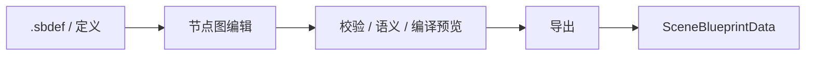
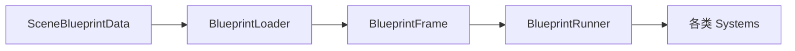
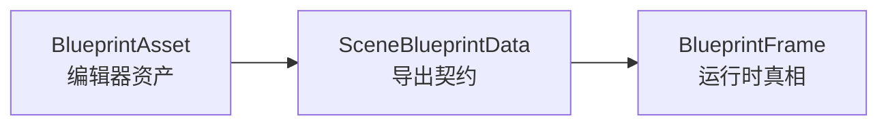
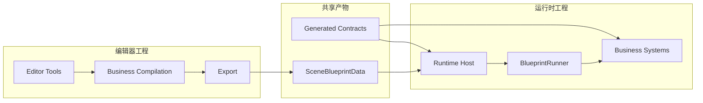
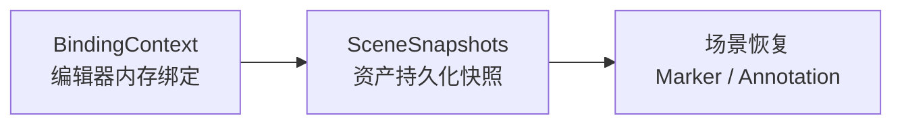
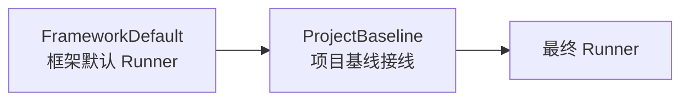

<div align="center">
  <h1>SceneBlueprint</h1>
  <p><strong>面向 Unity 的场景级蓝图编辑框架</strong></p>
  <p>DSL 定义 · 编辑器编排 · 导出契约 · 运行时解释执行</p>
  <p>
    
    
    
    
    
  </p>
</div>

| 维度 | 说明 |
|---|---|
| 🎯 核心定位 | 用一套正式的场景蓝图框架，把“制作蓝图”和“执行蓝图”拆成清晰的两部分 |
| 🧠 架构特征 | 参考编程语言解释器的思路，按声明、语义、计划、运行时状态、解释执行分层 |
| 🧩 项目组织 | 完全支持编辑器工程与运行时工程分离 |
| 👥 适用对象 | TA、策划工具开发、玩法框架、运行时蓝图接入、项目级场景流程系统 |

> 如果你第一次看这个仓库，建议先读“快速导航”与“两大部分”，再进入后面的架构细节。

## 🧭 快速导航

- [🧱 这是什么](#两大部分)
- [📦 怎么安装](#安装)
- [📝 怎么快速理解 DSL](#dsl-快速入门)
- [🏗️ 怎么理解整体架构](#架构)
- [🗂️ 先看哪几个核心类型](#三个最重要的数据载体)
- [🔑 有哪些容易漏掉的重要概念](#几个容易漏掉但很关键的概念)
- [👀 第一次进入代码库怎么看](#怎么阅读这个仓库)

## ✨ 功能亮点

| 能力 | 说明 |
|---|---|
| 🖥️ 可视化蓝图编辑器 | 基于 `com.zgx197.nodegraph` 的节点图编辑、工作区恢复、分析面板、预览与测试窗口 |
| 🔧 Action / Property / Blackboard 体系 | `ActionDefinition`、`PropertyDefinition`、`ActionRegistry`、变量声明与端口默认值统一收口 |
| 📍 Marker / Annotation / Spatial 体系 | 场景标记、标注导出、空间绑定、2D/3D 适配器、Gizmo 渲染与交互工具链 |
| 🧾 `.sbdef` DSL 工具链 | `.sbdef` 作为 SSOT，经 Unity Importer + `Tools~/SbdefGen` CLI 生成运行时与编辑器注册代码 |
| ▶️ 运行时解释器 | `BlueprintLoader`、`BlueprintRunner`、System 调度、SignalBus、运行时状态域、快照导出/回放 |
| 💡 知识与调试能力 | 编辑器内知识服务、AI Chat 面板、运行时状态浏览、帧历史与调试快照 |

## 🧪 运行环境

- Unity 2021.3+
- [`com.zgx197.nodegraph`](https://github.com/zgx197/com.zgx197.nodegraph) 0.1.0+

## 📦 安装

在项目的 `Packages/manifest.json` 中添加：

```json
{
  "dependencies": {
    "com.zgx197.sceneblueprint": "file:../../com.zgx197.sceneblueprint",
    "com.zgx197.nodegraph": "file:../../com.zgx197.nodegraph"
  }
}
```

## 📚 阅读建议

| 你现在最关心什么 | 建议先看 |
|---|---|
| 我只想知道这个仓库是干什么的 | “两大部分” |
| 我想知道编辑器和运行时怎么衔接 | “三个最重要的数据载体” |
| 我想知道为什么支持项目分离 | “完全支持编辑器和运行时项目分离” 与 “项目分离架构” |
| 我想知道业务层应该怎么接 | “业务侧如何承接这五层” |
| 我想正式读代码 | “怎么阅读这个仓库” |

## 🧱 两大部分

理解 SceneBlueprint，最简单的方式就是把它看成两部分：

1. **编辑器部分**：负责制作蓝图
2. **运行时部分**：负责执行蓝图

<table>
  <tr>
    <td width="50%" valign="top">
      <strong>🛠️ 编辑器部分</strong><br/>
      面向制作流程，关注定义、authoring、校验、编译预览和导出。
    </td>
    <td width="50%" valign="top">
      <strong>▶️ 运行时部分</strong><br/>
      面向执行流程，关注加载、调度、解释执行、状态、快照和调试。
    </td>
  </tr>
</table>

它们之间通过一个稳定的数据边界连接：


### 🛠️ 编辑器部分是做什么的

编辑器部分负责“写蓝图”。

你可以把它理解成一套 Unity 内的制作工具，它主要做这些事：

- 用 `.sbdef` 定义有哪些节点、Marker、Signal
- 在节点图编辑器里连线、配参数、绑定场景对象
- 在 Inspector 里看校验结果、编译结果和调试信息
- 导出成运行时可读取的数据

对应目录主要是：

- `Editor/`
- `Adapters/Unity2D`
- `Adapters/Unity3D`
- `Tools~/SbdefGen/`

### ▶️ 运行时部分是做什么的

运行时部分负责“跑蓝图”。

你可以把它理解成一个轻量解释器，它主要做这些事：

- 读取导出的 `SceneBlueprintData`
- 把数据加载成 `BlueprintFrame`
- 用 `BlueprintRunner` 按 Tick 驱动各个 `System`
- 维护黑板、事件、状态域、快照和调试历史

对应目录主要是：

- `Runtime/`
- `Core/`
- `Contract/`

### ❓ 为什么一定要分成这两部分

因为这两边要解决的问题根本不同：

- 编辑器关心的是“怎么配置、怎么校验、怎么导出”
- 运行时关心的是“怎么加载、怎么调度、怎么执行”

如果把这两边混在一起，最后就会出现两个问题：

- 运行时被编辑器逻辑污染
- 编辑器又会被运行时实现细节绑死

所以 SceneBlueprint 从一开始就把这两部分当成两个正式子系统，而不是一个大而全的单体工具。

> SceneBlueprint 最重要的设计判断不是“做一个节点编辑器”，而是“正式区分编辑器问题和运行时问题”。

### 🔀 完全支持编辑器和运行时项目分离

这一点不是口头上的“支持”，而是当前代码结构本身就这样设计的。

Package 侧已经拆开了：

- `SceneBlueprint.Editor`：只在 Unity Editor 下编译
- `SceneBlueprint.Runtime`：运行时部分
- `SceneBlueprint.Core` / `SceneBlueprint.Contract`：两边共享的基础层

用户项目也可以按同样方式拆开。`SceneBlueprintUser` 就是现成例子：

- `SceneBlueprintUser.Editor`：编辑器工具、Inspector、工作台
- `SceneBlueprintUser.Compilation`：业务编译层
- `SceneBlueprintUser.Actions`：正式定义承接层
- `SceneBlueprintUser.Systems`：运行时 System
- `SceneBlueprintUser.RuntimeEntry`：运行时入口契约

这意味着你完全可以这样组织项目：

- 一个工程专门给策划/TA做蓝图和导出
- 另一个工程只保留运行时和业务 System，专门负责加载导出的结果

更直白一点说：

- **做蓝图的人**不一定要碰运行时接入代码
- **做运行时的人**也不一定要带整个编辑器工具链

这就是 SceneBlueprint 很重要的一条设计目标：

> 编辑器和运行时既能协作，也能分离。

## 🗂️ 目录结构

| 目录 | 作用 |
|---|---|
| `Contract/` | 纯序列化契约层，定义 `SceneBlueprintData`、Signal、Runtime State、Knowledge 等跨层共享数据结构 |
| `Core/` | 核心定义层，包含 `ActionDefinition`、`ActionRegistry`、属性/端口/校验/可见性等基础模型 |
| `Domain/` | 领域层占位，承载不依赖 Unity 的领域模块边界 |
| `Application/` | 应用层占位，预留编译、校验、导出等流程的纯 C# 编排入口 |
| `SpatialAbstraction/` | 空间抽象层，定义绑定策略、放置策略、对象身份服务等接口 |
| `Adapters/Unity2D` / `Adapters/Unity3D` | Editor 侧空间适配器，实现 Unity 2D/3D 场景绑定与空间语义 |
| `Runtime/` | 运行时资产、解释器、系统调度、状态域、快照、知识与测试支持 |
| `Editor/` | 编辑器主窗口、Session、导出、分析、预览、Markers、Compilation、Interpreter、Knowledge 等工具 |
| `Tools~/SbdefGen/` | 脱离 Unity 的 `.sbdef` 代码生成 CLI，负责词法解析、语法解析与多类 emitter 输出 |
| `Documentation~/` | DSL 设计文档与 VS Code / Windsurf 语法高亮扩展 |
| `Templates/` / `Settings/` | 内置模板与项目级配置资产 |

## 📝 DSL 快速入门

在用户工程中创建 `.sbdef` 文件，例如 `Assets/Extensions/SceneBlueprintUser/Definitions/`：

```text
action VFX.CameraShake {
    displayName "镜头震动"
    category    "VFX"
    duration    instant

    port float Duration = 0.3 label "时长" min 0.1 max 5.0
    port float Intensity = 1.0 label "强度" min 0.0 max 3.0
}

action Spawn.Wave {
    displayName "波次刷怪"
    category    "Spawn"
    duration    duration

    port string SpawnArea  = "" label "刷新区域"
    port string Waves      = "" label "波次配置"
    flow OnWaveStart label "波次开始"
}

marker SpawnPoint {
    label "刷怪点"
    gizmo sphere(0.4)
}
```

保存后，Unity 中的 `SbdefAssetImporter` 会触发 `SbdefCodeGen`；后者会定位并按需构建 `Tools~/SbdefGen` CLI，再将生成结果写入用户工程的 `Generated/` 目录。

当前代码结构下，`.sbdef` 会按声明内容按需生成以下产物：

| 生成文件 | 内容 |
|---|---|
| `UAT.*.cs` | Action TypeId 常量 |
| `UActionPortIds.*.cs` | 端口 ID / `PropertyKey<T>` 常量 |
| `ActionDefs.*.cs` | `IActionDefinitionProvider` 实现 |
| `UMarkerTypeIds.*.cs` / `Markers/*.cs` / `Editor/UMarkerDefs.*.cs` | Marker 类型常量、运行时 Marker 类、Editor 侧 MarkerDefinitionProvider |
| `Annotations/*.cs` / `Editor/AnnotationDefs.*.cs` / `Enums/*.cs` | Annotation 运行时类、Editor 侧 AnnotationDefinitionProvider、相关枚举 |
| `USignalTags.*.cs` / `USignalPayloads.*.cs` | Signal 标签常量与 Payload 工厂 |
| `UTagDimensions.*.cs` / `TagDimensionDefs.*.cs` | Tag 维度常量与维度定义注册 |
| `Editor/EditorTools/*.cs` | Marker 的 Editor Tool partial 类骨架 |

## 🏗️ 架构

### 🧠 设计理念

如果你想再进一步理解内部实现，可以把 SceneBlueprint 看成一个“蓝图解释器”。

但这里不需要先记很多术语，只要先记住下面这句话：

> 编辑器负责把“作者写的内容”整理好，运行时负责把“整理好的内容”执行起来。

内部大致分成 5 步：

- 先有**声明层**：定义有哪些 Action、Marker、Signal、TagDimension。
- 再有**语义层**：把 authoring 输入整理成更正式的语义对象。
- 再有**计划层**：把可执行计划、compiled metadata、调试摘要统一产出。
- 再有**运行时状态层**：把导出数据加载成统一的 `BlueprintFrame`。
- 最后由**解释执行层**：`BlueprintRunner` 驱动一组无状态 `System` 循环解释。

| 用一句话理解 | 对应含义 |
|---|---|
| 编辑器负责整理作者输入 | 定义、authoring、校验、语义整理、导出前编译 |
| 导出边界负责稳定交付 | `SceneBlueprintData` 是编辑器与运行时之间的正式数据边界 |
| 运行时负责解释执行 | `BlueprintLoader -> BlueprintFrame -> BlueprintRunner -> Systems` |

### 🌐 整体架构

先看最粗粒度的整体结构：


如果只记一件事，就记这个：

- 左边是“怎么做蓝图”
- 中间是“导出的稳定数据”
- 右边是“怎么跑蓝图”

### 🪜 五层运行解释架构

这 5 层可以用很直白的话来理解：

1. **声明层**：系统里允许写什么
2. **语义层**：作者写出来的配置，真正表达的意思是什么
3. **计划层**：运行时最终要执行什么计划
4. **运行时状态层**：执行时所有数据放在哪里
5. **解释执行层**：谁在逐步推动蓝图运行

如果你不需要深入框架实现，其实只要知道这 5 层存在就够了。


### 🛠️ 编辑器部分内部链路

编辑器部分不要理解成“一个窗口”，它实际上是一条制作链路：



这张图里最重要的是：

- 编辑器不只是画图
- 编辑器还负责校验、语义整理和导出前编译

### ▶️ 运行时部分内部链路

运行时部分也不要理解成“直接读 JSON 然后 if-else 跑掉”，它同样有清晰主线：



这张图里最重要的是：

- `BlueprintLoader` 负责装载
- `BlueprintFrame` 负责持有运行时真相
- `BlueprintRunner` 负责调度
- `Systems` 负责具体执行逻辑

### 🗂️ 三个最重要的数据载体

很多人第一次看代码时，最容易混淆的是这三个类型：

- `BlueprintAsset`
- `SceneBlueprintData`
- `BlueprintFrame`

其实它们分别对应三个不同阶段：



可以直接这样记：

- `BlueprintAsset`：编辑器里的工作资产，保存图 JSON、变量声明、`SceneSnapshots` 等 authoring 信息
- `SceneBlueprintData`：编辑器导出给运行时的稳定契约，只保留运行时真正要消费的数据
- `BlueprintFrame`：蓝图进入运行时后的单一真相容器，静态数据、动态状态、黑板、事件队列都收口到这里

一句话概括就是：

- **编辑器改的是 `BlueprintAsset`**
- **导出传的是 `SceneBlueprintData`**
- **运行时真正跑的是 `BlueprintFrame`**

### 🔀 项目分离架构

如果项目要拆成“制作工程”和“运行时工程”，推荐按下面这个粗粒度理解：



这张图表达的重点是：

- 编辑器工程产出的是“契约”和“导出数据”
- 运行时工程消费的是“契约”和“导出数据”
- 两边可以协作，但不必写在同一个项目里

### 🔑 几个容易漏掉但很关键的概念

除了上面的主链路，代码里还有几组很重要、但第一次看 README 容易忽略的概念：

| 概念 | 直白理解 | 对应代码 |
|---|---|---|
| `BindingContext` / `SceneSnapshots` | `BindingContext` 是编辑器内存里的场景绑定真相；保存时会采集成 `BlueprintAsset.SceneSnapshots`，重新打开蓝图或切回锚定场景时再恢复 Marker / Annotation | `Editor/BindingContext.cs`、`Editor/Markers/Snapshot/`、`Runtime/BlueprintAsset.cs` |
| `BlueprintRunnerFactory` | Runner 不是临时拼起来的，而是先创建 `FrameworkDefault`，再按需叠加 `ProjectBaseline`；这正是“框架默认能力”和“项目业务接线”正式分层的地方 | `Runtime/Interpreter/BlueprintRunnerFactory.cs`、`Runtime/Interpreter/BlueprintRunnerConfiguratorRegistry.cs` |
| `RuntimeStateHost` | 运行时结构化状态中心。它统一挂载多个状态域，并提供生命周期、检查、快照导出与回放能力，而不是把可变状态散落在各个 `System` 里 | `Runtime/State/RuntimeStateHost.cs`、`Runtime/Interpreter/Systems/RuntimeStateHostBootstrapSupport.cs` |
| `SceneBlueprintProjectConfig` | 项目级总配置入口。运行时配置、框架覆盖、业务集成、项目级映射等都逐步收口到这里；`BlueprintRuntimeSettings` 当前主要是兼容壳 | `Runtime/Settings/SceneBlueprintProjectConfig.cs`、`Runtime/BlueprintRuntimeSettings.cs` |
| `BlueprintNodeWorkspace` | 对复杂业务节点，Inspector 不是唯一入口；可以给某类节点提供专用工作台窗口，形成“节点图 + 专项工作台”的编辑体验 | `Editor/Workspaces/BlueprintNodeWorkspace.cs`、`Editor/Workspaces/BlueprintNodeWorkspaceWindow.cs` |
| `KnowledgeService` / `AIChatPanel` | 编辑器内置知识与 AI 助手体系，会把知识库、Embedding、当前 Session 上下文和 MCP 服务统一接起来 | `Editor/Knowledge/KnowledgeService.cs`、`Editor/Knowledge/ChatPanel/AIChatPanel.cs` |

其中最容易混淆的两条链路，可以再单独看成下面两张小图：





如果只从代码结构上总结一句话，这些概念说明 SceneBlueprint 其实不只是“节点图编辑器 + 运行时解释器”，它还内建了：

- 绑定恢复机制
- 结构化运行时状态
- 快照与回放
- 项目级配置中心
- 专项节点工作台
- 知识库与 AI 辅助

<details>
<summary><strong>展开查看五层解释架构的实现细节</strong></summary>

### 第 1 层：声明层

这一层就是“系统允许你写什么”。

对应内容包括：

- `Core/`
- `Contract/`
- `SpatialAbstraction/`
- `Tools~/SbdefGen/`

比如：

- `.sbdef` 里可以声明什么节点
- 一个 Action 有哪些端口、属性、校验规则
- 导出的 `SceneBlueprintData` 长什么样

### 第 2 层：语义层

这一层就是“把配置解释成正式含义”。

例如一个节点表面上只是填了几项属性，但系统需要进一步知道：

- 它的主体是谁
- 目标是谁
- 条件是什么
- 它在图结构里的正式角色是什么

对应代码：

- `Editor/Compilation/ActionCompilationArtifact.cs`
- `Contract/SemanticDescriptor*.cs`
- 业务侧 `*AuthoringSpecBuilder`、`*SemanticBuilder`

### 第 3 层：计划层

这一层就是“把语义整理成可执行计划”。

重点不是再去读一遍作者原始输入，而是产出运行时真正需要的东西：

- compiled plan
- transport metadata
- 诊断
- 调试摘要

对应代码：

- `Editor/Export/BlueprintExporter.cs`
- `Editor/Compilation/`
- `Runtime/Interpreter/CompiledActionResolver.cs`
- 业务侧 `Editor/Export/*ActionCompiler.cs`

### 第 4 层：运行时状态层

这一层的核心就是 `BlueprintFrame`。

你可以把它理解成：

- 蓝图进入运行时以后，所有正式状态都收口到这里
- System 自己尽量不保存可变状态
- 谁想知道蓝图当前跑到哪里了，就看 `BlueprintFrame`

对应代码：

- `Runtime/Interpreter/BlueprintLoader.cs`
- `Runtime/Interpreter/BlueprintFrame.cs`
- `Runtime/State/`
- `Runtime/Snapshot/`

### 第 5 层：解释执行层

这一层就是“谁在真正跑蓝图”。

这里最重要的两个角色是：

- `BlueprintRunner`
- `BlueprintSystemBase`

可以把它理解成：

- `BlueprintRunner` 负责主循环
- 各个 `System` 负责具体节点类型的执行逻辑

对应代码：

- `Runtime/Interpreter/BlueprintRunner.cs`
- `Runtime/Interpreter/BlueprintSystemBase.cs`
- `Runtime/Interpreter/Systems/GraphNodeExecutionTemplate.cs`
- `Runtime/Interpreter/Systems/`

### 业务侧如何承接这五层

从 `SceneBlueprintUser` 的实际结构来看，推荐的业务侧接法很明确：

1. `Definitions/*.sbdef` 负责声明稳定契约。
2. `Generated/*.cs` 提供 `UAT.*`、`UActionPortIds.*`、`USignalTags.*` 等稳定常量。
3. `Actions/*ActionDefs.cs` 与 `*Definition/` 人工承接正式定义、graph role、validator、authoring 规则。
4. `Editor/Export/*ActionCompiler.cs` 把 authoring 输入编译成业务计划与 metadata。
5. `Systems/*System.cs` 在运行时消费 compiled plan，真正解释执行。

这套模式有一个很重要的收益：

- 框架层保持通用
- 业务层可以很重
- 但“重”在定义、语义、编译、执行各层各归各位，而不是糊成一团

### 编辑器在这五层中的位置

编辑器不是单独的一层执行层，而是这五层前半段的编排器。

它主要做三件事：

1. 让作者能编辑声明和图结构
2. 让语义、计划、诊断能在 authoring 阶段就被看见
3. 在导出前把图数据、绑定、Annotation、变量声明统一收口

最重要的两个入口是：

- `Editor/SceneBlueprintWindow.cs`
- `Editor/Session/BlueprintEditorSession.cs`

</details>

### 👀 怎么阅读这个仓库

第一次进入代码库，建议按这个顺序看：

1. 先看本 README 的“两大部分”
2. 再看 `Contract/SceneBlueprintData.cs`
3. 再看 `Editor/SceneBlueprintWindow.cs` 和 `Editor/Session/BlueprintEditorSession.cs`
4. 再看 `Editor/Export/BlueprintExporter.cs`
5. 再看 `Runtime/Interpreter/BlueprintLoader.cs` 和 `Runtime/Interpreter/BlueprintRunner.cs`
6. 最后再看 `Tools~/SbdefGen/`

## 🚪 关键入口

<table>
  <tr>
    <td width="33%" valign="top">
      <strong>🛠️ Editor</strong><br/><br/>
      <code>Editor/SceneBlueprintWindow.cs</code><br/>
      编辑器主窗口<br/><br/>
      <code>Editor/Session/BlueprintEditorSession.cs</code><br/>
      编辑器会话与状态组织<br/><br/>
      <code>Editor/Export/BlueprintExporter.cs</code><br/>
      导出入口
    </td>
    <td width="33%" valign="top">
      <strong>🧾 DSL</strong><br/><br/>
      <code>Editor/CodeGen/Sbdef/SbdefAssetImporter.cs</code><br/>
      DSL 导入与触发<br/><br/>
      <code>Editor/CodeGen/Sbdef/SbdefCodeGen.cs</code><br/>
      Unity 内代码生成编排入口<br/><br/>
      <code>Tools~/SbdefGen/Program.cs</code><br/>
      外部 CLI 主程序
    </td>
    <td width="33%" valign="top">
      <strong>▶️ Runtime</strong><br/><br/>
      <code>Runtime/BlueprintAsset.cs</code><br/>
      蓝图资产<br/><br/>
      <code>Runtime/Interpreter/BlueprintLoader.cs</code><br/>
      运行时装载入口<br/><br/>
      <code>Runtime/Interpreter/BlueprintRunner.cs</code><br/>
      运行时调度入口
    </td>
  </tr>
</table>

## 📚 进一步文档

如果你已经读完 README，接下来推荐这样继续：

- 先看 DSL 设计文档，理解 `.sbdef` 的正式声明方式
- 再看语法高亮扩展，方便在编辑器里直接阅读和维护 DSL
- 如果要接业务层，再结合用户工程里的 `SceneBlueprintUser` 结构一起对照阅读

## 🎨 语法高亮

`Documentation~/vscode-sbdef/` 目录中包含 `.sbdef` 的 TextMate 语法高亮扩展，安装方式见 [`Documentation~/vscode-sbdef/README.md`](Documentation~/vscode-sbdef/README.md)。

## 📄 文档

<table>
  <tr>
    <td width="50%" valign="top">
      <strong>🧾 DSL 设计文档</strong><br/><br/>
      <a href="Documentation~/SbdefDSL-Design.md"><code>Documentation~/SbdefDSL-Design.md</code></a><br/>
      适合想理解 <code>.sbdef</code> 语法、生成链路和设计边界的人继续阅读。
    </td>
    <td width="50%" valign="top">
      <strong>🎨 VS Code / Windsurf 语法高亮</strong><br/><br/>
      <a href="Documentation~/vscode-sbdef/README.md"><code>Documentation~/vscode-sbdef/README.md</code></a><br/>
      适合准备正式维护 DSL 文件、需要更顺手编辑体验的人继续配置。
    </td>
  </tr>
</table>
